# BusinessFlow

> ## 목차
>
> - [Flow 1: 구매자 구매 여정](#flow-1-구매자-구매-여정)
> - [Flow 2: 주문 + 결제 트랜잭션](#flow-2-주문--결제-트랜잭션)
> - [Flow 3: 판매자 주문/배송 관리](#flow-3-판매자-주문배송-관리)
> - [Flow 4: 선착순 쿠폰 발급](#flow-4-선착순-쿠폰-발급)
> - [Flow 5: JWT 인증 + RBAC](#flow-5-jwt-인증--rbac)
> - [Flow 6: 상품 등록 → 승인](#flow-6-상품-등록--승인)
> - [Flow 7: 포인트 적립/사용/만료](#flow-7-포인트-적립사용만료)
> - [Flow 8: AI 리뷰 요약 + 추천](#flow-8-ai-리뷰-요약--추천)
> - [Flow 9: 구독 라이프사이클](#flow-9-구독-라이프사이클)
> - [Flow 10: Outbox → Kafka 이벤트 파이프라인](#flow-10-outbox--kafka-이벤트-파이프라인)
> - [Flow 11: 주문 취소 플로우 (보상 트랜잭션)](#flow-11-주문-취소-플로우-보상-트랜잭션)
> - [Flow 12: 전체 이벤트 연결 맵](#flow-12-전체-이벤트-연결-맵)

---

## Flow 1: 구매자 구매 여정


<details>
<summary>구매자 구매 여정</summary>
<div markdown="1">

```Mermaid
flowchart TD
    %% 비로그인 가능 영역 (Public)
    A[상품 검색] -->|"GET /api/products?keyword="| B[상품 목록]
    B -->|"GET /api/products/productId"| C[상품 상세]
    C -->|Redis INCR 조회수| C
    C -->|"GET /api/products/productId/reviews"| D{리뷰 확인}
    C -->|"GET /api/products/productId/reviews/summary"| E[AI 리뷰 요약]

    %% 사용자의 구매/장바구니 액션 분기
    C -->|장바구니 클릭| Action_Cart[장바구니 담기 요청]
    C -->|바로구매 클릭| Action_Direct[바로구매 요청]
    
    Action_Cart --> Auth_User{"로그인 상태 확인<br/>JWT 토큰 검증"}
    Action_Direct --> Auth_User
    
    %% 사용자 인증 (Authentication) 분기
    Auth_User -->|미인증| Login["로그인 진행<br/>POST /api/auth/login"]
    Login -->|Access Token 발급| Auth_User
    
    %% 인증 필요 영역 (User API)
    Auth_User -->|"인증 완료 (장바구니 경로)"| F["장바구니 담기<br/>POST /api/cart/items"]
    F --> G[장바구니]
    G -->|"GET /api/cart<br/>Header: Authorization"| H{주문할 상품 선택}

    %% 장바구니 일부/전체 결제 분기
    H -->|전체 선택| H1[주문서 작성]
    H -->|일부 선택| H1[주문서 작성]

    %% 바로구매 인증 완료 시 다이렉트 패스
    Auth_User -->|"인증 완료 (바로구매 경로)"| H1

    %% 주문 생성 로직 (장바구니 ID or 직접구매 품목 정보 수용)
    H1 -->|"POST /api/orders<br/>Body: 장바구니 ID 목록 OR 직접구매<br/>Header: Authorization"| I["주문 생성<br/>status: PENDING_PAYMENT<br/>선택 상품만 재고 선점 - 비관적 락"]
    I -->|"POST /api/payments<br/>Header: Authorization"| J["결제 승인<br/>토스페이먼츠 paymentKey<br/>포인트/쿠폰 차감"]
    J -->|status: PAID| K[주문 완료]

    %% 장바구니 후처리
    K -->|구매가 완료된 항목만| Cart_Cleanup["장바구니 비우기<br/>DELETE /api/cart/items"]
    
   J -->|"결제 트랜잭션 내"| L[배송 ACCEPT 생성]
    
    %% 판매자 인가 (Authorization) 분기
    L --> Auth_Seller{"판매자 권한 확인<br/>Role: SELLER"}
    
    %% 인가 필요 영역 (Seller API)
    Auth_Seller -->|권한 없음| 403[403 Forbidden]
    Auth_Seller -->|권한 확인됨| M["판매자 발주확인<br/>INSTRUCT"]
    
    M -->|"운송장 등록<br/>Header: Authorization"| N["배송지시<br/>DEPARTURE"]
    N --> O["배송중<br/>DELIVERING"]
    O --> P["배송완료<br/>FINAL_DELIVERY"]

    %% 서버 내부 로직 및 사용자 인증 영역
    P -->|"Kafka: shipping-delivered"| Q["포인트 자동 적립<br/>결제금액 1%"]
    P -->|"GET /api/users/me/reviewable<br/>Header: Authorization"| R[리뷰 작성 가능]
    R -->|"POST /api/reviews<br/>Header: Authorization"| S[리뷰 작성 완료]

    %% 스타일링
    style I fill:#E6F1FB,stroke:#185FA5
    style J fill:#EEEDFE,stroke:#534AB7
    style K fill:#EAF3DE,stroke:#639922
    style P fill:#EAF3DE,stroke:#639922
    style Cart_Cleanup fill:#F5F5F5,stroke:#999999,stroke-dasharray: 5 5
    
    %% 인증/인가 노드 강조
    style Auth_User fill:#FFF2CC,stroke:#D6B656,stroke-width:2px
    style Login fill:#FFF2CC,stroke:#D6B656
    style Auth_Seller fill:#F8CECC,stroke:#B85450,stroke-width:2px
    style 403 fill:#F8CECC,stroke:#B85450
    style Action_Cart fill:#E1D5E7,stroke:#9673A6
    style Action_Direct fill:#D5E8D4,stroke:#82B366
```

</div>
</details>

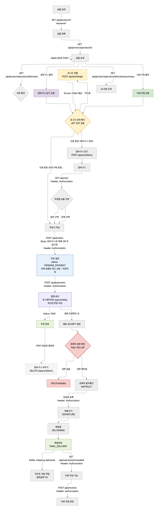

### 관련 API

| 단계 | API | 핵심 기술 |
| --- | --- | --- |
| 검색 | `GET /api/products` | MySQL FULLTEXT + Redis ZINCRBY(인기검색어) |
| 상세 | `GET /api/products/{id}` | Redis INCR(조회수) + Caffeine(상품캐시) |
| 장바구니 | `POST /api/cart/items` | DB Cart + CartItem (UNIQUE 제약) |
| 주문 | `POST /api/orders` | 비관적 락(재고 선점) + item_id ASC(데드락 방지) |
| 결제 | `POST /api/payments` | 토스페이먼츠 + 낙관적 락(포인트) + Outbox |
| 리뷰 | `POST /api/reviews` | order_item_id UNIQUE + S3(이미지) |

---
## Flow 2: 주문 + 결제 트랜잭션

<details>
<summary>주문 + 결제 트랜잭션</summary>
<div markdown="1">

```Mermaid
flowchart TD
    A[POST /api/orders] --> B{상품/재고/쿠폰 검증}
    B -->|실패| B1[400 ORDER_001~005]

    B -->|성공| C["@Transactional 시작"]

    subgraph TX ["트랜잭션 (1단계: 주문 생성)"]
        C --> D["재고 선점<br/>SELECT FOR UPDATE<br/>item_id ASC 정렬"]
        D -->|재고 부족| D1["INVENTORY_001<br/>주문 생성 실패"]
        D -->|성공| E["주문 생성<br/>order + order_item<br/>itemName, price 스냅샷"]
        E --> F["status: PENDING_PAYMENT"]
    end

    F --> G["201 Created<br/>orderId 반환"]

    G --> H["POST /api/payments<br/>paymentKey + amount"]

    subgraph TX2 ["트랜잭션 (2단계: 결제 승인)"]
        H --> I{"토스페이먼츠 승인"}
        I -->|실패| I1["PAYMENT_002<br/>PG 승인 실패<br/>주문 취소 + 재고 복구 +<br/>status: CANCELLED"]
        I -->|성공| J["포인트 차감<br/>@Version 낙관적 락"]
        J -->|부족| J1["POINT_001<br/>PG 승인 취소 +<br/>재고 복구 +<br/>status: CANCELLED"]
        J -->|성공| K["쿠폰 차감<br/>Redis 분산락"]
        K -->|실패| K1["COUPON_001<br/>PG 승인 취소 +<br/>포인트 복구 +<br/>재고 복구 +<br/>status: CANCELLED"]
        K -->|성공| L["결제 완료 +<br/>status: PAID"]
        L --> L2["배송 생성<br/>OrderItem → ORDERED<br/>Delivery → ACCEPT"]
        L2 --> M["Outbox INSERT<br/>topic: order-paid"]
    end

    M --> N["Kafka: order-paid"]
    N --> P["Consumer: 구매자 결제 완료 알림 (SSE)"]

    style TX fill:#E6F1FB,stroke:#185FA5
    style TX2 fill:#EEEDFE,stroke:#534AB7
    style D1 fill:#FCEBEB,stroke:#A32D2D
    style I1 fill:#FCEBEB,stroke:#A32D2D
    style J1 fill:#FCEBEB,stroke:#A32D2D
    style K1 fill:#FCEBEB,stroke:#A32D2D

```

</div>
</details>

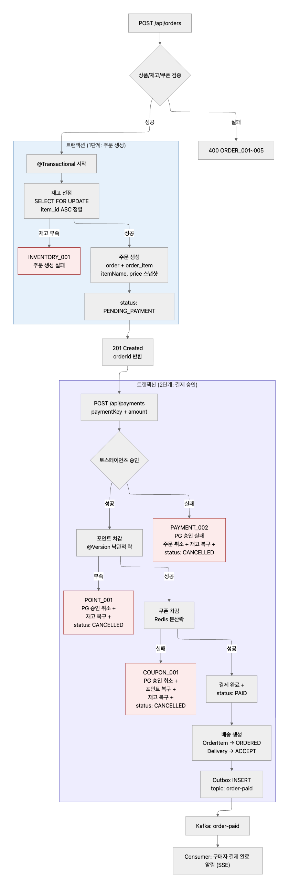

### 실패 시 복구 매트릭스

| 실패 지점 | 재고 | 포인트 | 쿠폰 | 결제 | 주문 |
| --- | --- | --- | --- | --- | --- |
| 1단계: 재고 선점 실패 | ❌ 차감 안됨 | - | - | - | ❌ 생성 실패 |
| 2단계: PG 승인 실패 | ✅ 복구 | - | - | ❌ 승인 실패 | ✅ CANCELLED |
| 2단계: 포인트 차감 실패 | ✅ 복구 | ❌ 차감 안됨 | - | ✅ PG 승인 취소 | ✅ CANCELLED |
| 2단계: 쿠폰 차감 실패 | ✅ 복구 | ✅ 복구 | ❌ 사용 안됨 | ✅ PG 승인 취소 | ✅ CANCELLED |
| 성공 | ✅ 차감 완료 | ✅ 차감 완료 | ✅ 사용 완료 | ✅ 승인 완료 | ✅ PAID |

---

## Flow 3: 판매자 주문/배송 관리

<details>
<summary>판매자 주문/배송 관리</summary>
<div markdown="1">

```Mermaid
flowchart TD
    %% 인증/인가 영역
    Login["판매자 로그인<br/>POST /api/auth/login"] --> Auth_Seller{"판매자 권한 확인<br/>JWT 검증 & Role: SELLER"}
    Auth_Seller -->|권한 없음| 403["403 Forbidden"]
    Auth_Seller -->|권한 확인됨| Dashboard["판매자 대시보드<br/>SSE 실시간 연결"]

    %% 비동기 주문 알림 수신
    A["Kafka: order-paid 수신"] -->|SSE 푸시 알림| Dashboard

    %% 주문 확인 및 처리 (인가된 요청)
    Dashboard --> C["GET /api/seller/orders<br/>status=ORDERED<br/>Header: Authorization"]

    C --> D{판매자 결정}

    D -->|확인| E["POST /api/seller/orders/{id}/confirm<br/>Header: Authorization"]
    D -->|거절| F["POST /api/seller/orders/{id}/reject<br/>Header: Authorization"]

    E --> G["order_item: CONFIRMED<br/>delivery: INSTRUCT<br/>Kafka: order-confirmed"]

    F --> H["order_item: REJECTED<br/>부분 환불 처리<br/>재고 복구"]
    H --> H1["Kafka: order-rejected<br/>→ 구매자 알림"]

    G --> I["POST /api/seller/deliveries/{id}/ship<br/>운송장 등록<br/>Header: Authorization"]
    I --> J["delivery: DEPARTURE<br/>Kafka: shipping-started<br/>→ 구매자 알림"]

    J --> K["PATCH /api/seller/deliveries/{id}/status<br/>status=DELIVERING<br/>Header: Authorization"]
    K --> L["delivery: DELIVERING"]

    L --> M["PATCH /api/seller/deliveries/{id}/status<br/>status=FINAL_DELIVERY<br/>Header: Authorization"]
    M --> N["delivery: FINAL_DELIVERY<br/>order_item: DELIVERED"]

    N --> O["Kafka: shipping-delivered"]
    O --> P["PointConsumer<br/>결제금액 1% 적립"]
    O --> Q["NotificationConsumer<br/>배송완료 알림"]
    O --> R["리뷰 작성 가능"]

    %% 스타일링
    style E fill:#EAF3DE,stroke:#639922
    style F fill:#FCEBEB,stroke:#A32D2D
    style N fill:#EAF3DE,stroke:#639922
    style Auth_Seller fill:#F8CECC,stroke:#B85450,stroke-width:2px
    style 403 fill:#F8CECC,stroke:#B85450
    style Login fill:#FFF2CC,stroke:#D6B656

```

</div>
</details>

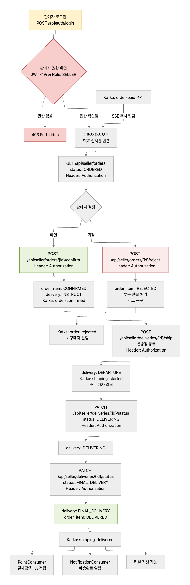

### 상태 전이 상세

<details>
<summary>상태 전이 상세</summary>
<div markdown="1">

```Mermaid
stateDiagram-v2
    [*] --> ORDERED : 결제 완료

    state "판매자 처리" as seller {
        ORDERED --> CONFIRMED : POST /seller/orders/{id}/confirm
        ORDERED --> REJECTED : POST /seller/orders/{id}/reject
    }

    state "배송 처리" as delivery {
        CONFIRMED --> INSTRUCT : 발주 확인 (상품준비중)
        INSTRUCT --> DEPARTURE : POST /seller/deliveries/{id}/ship (운송장 등록)
        DEPARTURE --> DELIVERING : PATCH status=DELIVERING
        DELIVERING --> FINAL_DELIVERY : PATCH status=FINAL_DELIVERY
    }

    FINAL_DELIVERY --> DELIVERED : order_item 자동 변경

```

</div>
</details>

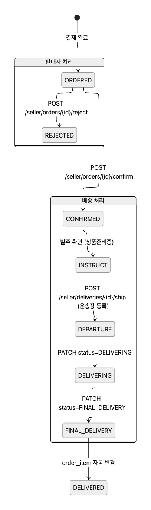

### 부분 취소 시나리오

<details>
<summary>부분 취소 시나리오</summary>
<div markdown="1">

```Mermaid

flowchart LR
    subgraph "주문 #1001"
        A["order_item #1<br/>노트북 (판매자A)<br/>✅ CONFIRMED → DELIVERED"]
        B["order_item #2<br/>마우스 (판매자B)<br/>❌ REJECTED"]
        C["order_item #3<br/>키보드 (판매자B)<br/>❌ REJECTED"]
    end

    B --> D["마우스 금액 환불<br/>+ 재고 복구"]
    C --> E["키보드 금액 환불<br/>+ 재고 복구"]

    style A fill:#EAF3DE,stroke:#639922
    style B fill:#FCEBEB,stroke:#A32D2D
    style C fill:#FCEBEB,stroke:#A32D2D

```

</div>
</details>

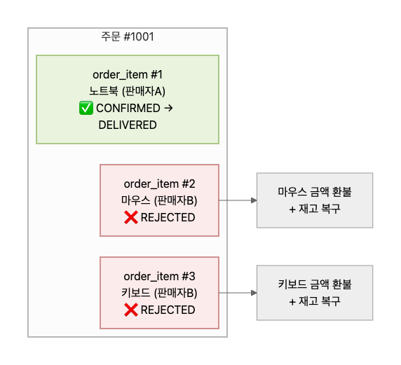

## Flow 4: 선착순 쿠폰 발급

<details>
<summary>선착순 쿠폰 발급</summary>
<div markdown="1">

```Mermaid

flowchart TD
    %% 1. 노드(도형) 정의
    A["POST /api/coupons/[couponId]/issue"]
    B{"Redis SISMEMBER<br/>coupon:issued:[couponId]<br/>userId 존재?"}
    B1["409 COUPON_002<br/>이미 다운로드한 쿠폰"]
    C["Redis DECR<br/>coupon:stock:[couponId]"]
    D{"재고(remaining)<br/>0 이상인가?"}
    E["Redis INCR<br/>(복원)"]
    E1["400 COUPON_001<br/>수량 소진"]
    F["Redis SADD<br/>coupon:issued:[couponId]<br/>userId 마킹"]
    G["Kafka: coupon-issued<br/>이벤트 발행"]
    H["CouponDbConsumer<br/>DB INSERT<br/>user_coupon 테이블"]
    I["200 OK<br/>userCouponId 반환<br/>status: AVAILABLE"]

    %% 2. 엣지(연결선) 정의
    A --> B
    B -->|이미 발급| B1
    B -->|미발급| C
    
    C --> D
    
    D -->|음수 소진| E
    E --> E1
    
    D -->|0 이상 성공| F
    F --> G
    G --> H
    H --> I

    %% 3. 스타일 정의
    style C fill:#FAECE7,stroke:#993C1D
    style F fill:#EAF3DE,stroke:#639922
    style E1 fill:#FCEBEB,stroke:#A32D2D
    style B1 fill:#FCEBEB,stroke:#A32D2D

```

</div>
</details>

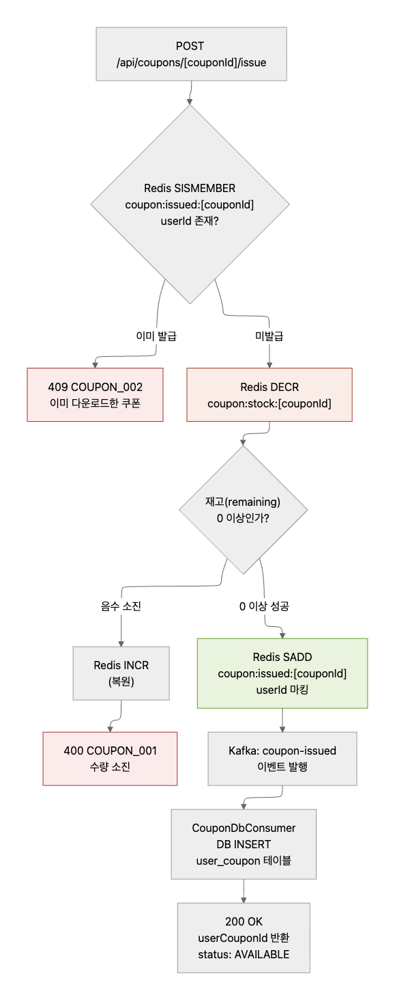

### 부하테스트 시나리오

<details>
<summary>부하테스트 시나리오</summary>
<div markdown="1">

```Mermaid

flowchart LR
    A["k6: 10,000 VU<br/>동시 요청"] --> B["Redis DECR<br/>원자적 처리"]
    B --> C{"결과"}
    C -->|"remaining >= 0<br/>(100건)"| D["✅ 발급 성공"]
    C -->|"remaining < 0<br/>(9,900건)"| E["❌ 소진 응답"]

    D --> F["검증:<br/>user_coupon = 100건<br/>coupon:stock = 0<br/>초과 발급 = 0건"]

    style D fill:#EAF3DE,stroke:#639922
    style E fill:#FCEBEB,stroke:#A32D2D
    style F fill:#E6F1FB,stroke:#185FA5

```

</div>
</details>

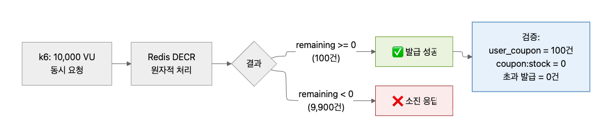

## Flow 5: JWT 인증 + RBAC

<details>
<summary>JWT 인증 + RBAC</summary>
<div markdown="1">

```Mermaid

flowchart TD
    A["POST /api/auth/login<br/>email + password"] --> B{"BCrypt 검증"}

    B -->|실패| B1["401 AUTH_004"]
    B -->|정지 계정| B2["403 AUTH_005"]

    B -->|성공| C["Access Token 발급<br/>(15분, role in payload)"]
    C --> D["Refresh Token 발급<br/>(14일, Redis 저장)"]
    D --> E["200 OK<br/>tokens + user info"]

    E --> F["API 요청<br/>Authorization: Bearer {AT}"]

    F --> G{"JwtFilter<br/>토큰 검증"}
    G -->|만료| G1["401 AUTH_008"]
    G -->|위조| G2["401 AUTH_009"]
    G -->|유효| H{"RBAC 체크<br/>role 확인"}

    H -->|BUYER| H1["/api/orders/**<br/>/api/cart/**<br/>/api/reviews/**"]
    H -->|SELLER| H2["/api/seller/**<br/>+ BUYER 권한"]
    H -->|ADMIN| H3["/api/admin/**<br/>+ ADMIN 권한"]
    H -->|SUPER_ADMIN| H4["/api/admin/**<br/>+ 모든 권한"]
    H -->|권한 없음| H5["403 AUTH_011"]

    G1 --> I["POST /api/auth/refresh<br/>refreshToken 전송"]
    I --> J{"Redis 검증"}
    J -->|유효| K["새 Access Token"]
    J -->|만료/불일치| L["401 AUTH_010<br/>재로그인 필요"]

    style C fill:#EEEDFE,stroke:#534AB7
    style D fill:#FAECE7,stroke:#993C1D
    style H1 fill:#E6F1FB,stroke:#185FA5
    style H2 fill:#FAECE7,stroke:#993C1D
    style H3 fill:#EEEDFE,stroke:#534AB7

```

</div>
</details>

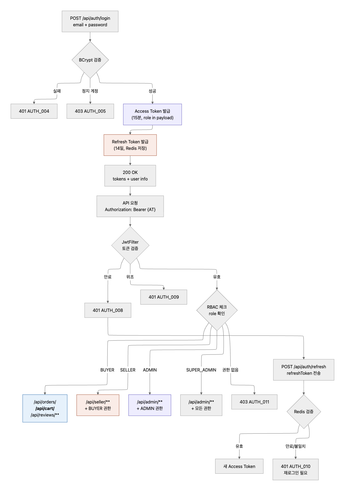

### 토큰 라이프사이클

<details>
<summary>토큰 라이프사이클</summary>
<div markdown="1">

```Mermaid

sequenceDiagram
    participant Client
    participant Server
    participant Redis

    Client->>Server: POST /api/auth/login
    Server->>Server: BCrypt 검증
    Server->>Redis: SET refresh:{userId} token (TTL 14d)
    Server-->>Client: accessToken(15m) + refreshToken

    Note over Client: 15분 후 AT 만료

    Client->>Server: GET /api/orders (만료된 AT)
    Server-->>Client: 401 AUTH_008

    Client->>Server: POST /api/auth/refresh
    Server->>Redis: GET refresh:{userId}
    Redis-->>Server: token (일치 확인)
    Server-->>Client: 새 accessToken(15m)

    Note over Client: 로그아웃

    Client->>Server: POST /api/auth/logout
    Server->>Redis: DEL refresh:{userId}
    Server-->>Client: 200 OK

```

</div>
</details>

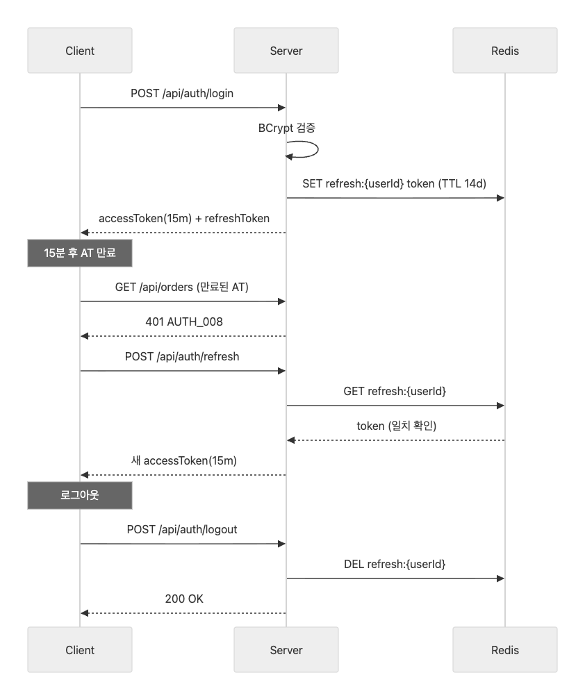

## Flow 6: 상품 등록 → 승인

<details>
<summary>상품 등록 → 승인</summary>
<div markdown="1">

```Mermaid

flowchart TD
    A["판매자: POST /api/seller/products<br/>상품 등록 (multipart)"] --> B["product.status = TEMP_SAVED<br/>S3 이미지 업로드<br/>ProductItem 옵션 생성"]

    B --> C{"추가 수정?"}
    C -->|수정| D["PATCH /api/seller/products/{id}<br/>상품 정보 수정"]
    D --> C
    C -->|완료| E["POST /seller/products/{id}/request-approval<br/>승인 요청"]
    E --> F["status: APPROVE_REQUESTED"]

    F --> G["관리자: GET /api/admin/products<br/>status=APPROVE_REQUESTED"]
    G --> H{관리자 결정}

    H -->|승인| I["PATCH /admin/products/{id}/approve"]
    I --> J["status: APPROVED<br/>Kafka: product-approved<br/>→ 판매자 알림"]
    J --> K["구매자 검색에 노출"]

    H -->|반려| L["PATCH /admin/products/{id}/reject<br/>reason 필수"]
    L --> M["status: REJECTED<br/>Kafka: product-rejected<br/>→ 판매자 알림"]
    M --> N["판매자 수정 후 재요청 가능"]
    N --> E

    style B fill:#F1EFE8,stroke:#5F5E5A
    style F fill:#FAEEDA,stroke:#854F0B
    style J fill:#EAF3DE,stroke:#639922
    style M fill:#FCEBEB,stroke:#A32D2D

```

</div>
</details>

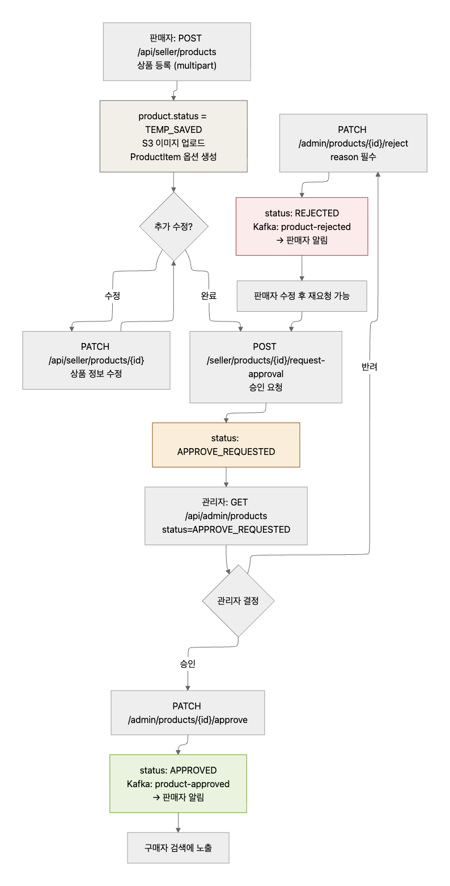

### 상품 상태 머신

<details>
<summary>상품 상태 머신</summary>
<div markdown="1">

```Mermaid

stateDiagram-v2
    [*] --> TEMP_SAVED : POST /seller/products

    TEMP_SAVED --> APPROVE_REQUESTED : POST /seller/products/{id}/request-approval
    APPROVE_REQUESTED --> APPROVED : PATCH /admin/products/{id}/approve
    APPROVE_REQUESTED --> REJECTED : PATCH /admin/products/{id}/reject

    REJECTED --> TEMP_SAVED : 판매자 수정

    APPROVED --> DISCONTINUED : DELETE /seller/products/{id}
    APPROVED --> FORCE_INACTIVE : DELETE /admin/products/{id} (강제)

    note right of APPROVED : 구매자 검색에 노출
    note right of TEMP_SAVED : 임시 저장 (비공개)

```

</div>
</details>

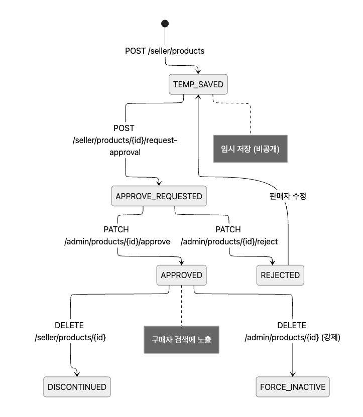

## Flow 7: 포인트 적립/사용/만료

<details>
<summary>포인트 적립/사용/만료</summary>
<div markdown="1">

```Mermaid

flowchart TD
    subgraph "적립 (자동)"
        A["배송완료<br/>FINAL_DELIVERY"] --> B["Kafka: shipping-delivered"]
        B --> C["PointConsumer"]
        C --> D["결제금액 × 1%<br/>point.balance += amount<br/>@Version 낙관적 락"]
        D --> E["point_history INSERT<br/>type=EARN, expire_at=+1년"]
    end

    subgraph "충전 (테스트)"
        F["POST /api/users/me/points/charge<br/>amount: 10000"] --> G["point.balance += 10000<br/>@Version + @Retryable"]
        G --> H["point_history INSERT<br/>type=EARN, expire_at=+1년"]
    end

    subgraph "사용 (주문 시)"
        I["POST /api/payments<br/>usedPoint: 5000"] --> J["point.balance -= 5000<br/>@Version 낙관적 락"]
        J --> K["point_history INSERT<br/>type=USE"]
    end

    subgraph "만료 (스케줄러)"
        L["@Scheduled 매일 03:00"] --> M{"expire_at <= today?"}
        M -->|만료 대상 존재| N["point.balance -= 만료금액"]
        N --> O["point_history INSERT<br/>type=EXPIRE"]
        M -->|없음| P["skip"]
    end

    subgraph "복구 (주문 취소 시)"
        Q["POST /api/orders/{id}/cancel"] --> R["point.balance += usedPoint"]
        R --> S["point_history INSERT<br/>type=REFUND"]
    end

    style D fill:#EAF3DE,stroke:#639922
    style J fill:#FAEEDA,stroke:#854F0B
    style N fill:#FCEBEB,stroke:#A32D2D
    style R fill:#E6F1FB,stroke:#185FA5

```

</div>
</details>

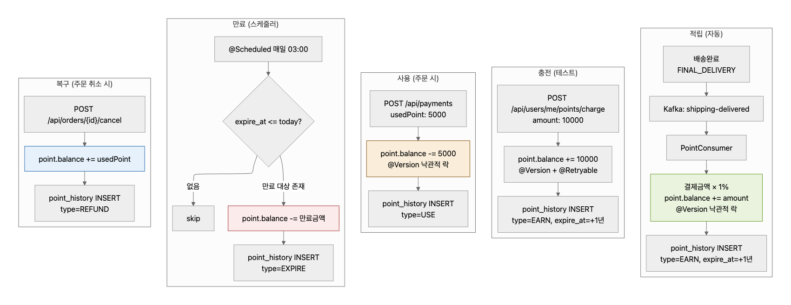

### 정합성 검증

<details>
<summary>정합성 검증</summary>
<div markdown="1">

```Mermaid

flowchart LR
    A["point.balance"] -->|항상 일치| B["SUM(point_history)<br/>EARN - USE - EXPIRE + REFUND"]
    B --> C["@Scheduled 매일 03:00<br/>감사 스케줄러로 검증"]

    style C fill:#E6F1FB,stroke:#185FA5

```

</div>
</details>

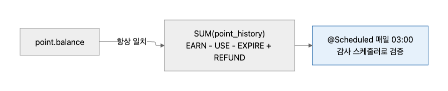

## Flow 8: AI 리뷰 요약 + 추천

<details>
<summary>AI 리뷰 요약 + 추천</summary>
<div markdown="1">

```Mermaid

flowchart TD
    subgraph "리뷰 요약 (Spring AI)"
        A["리뷰 10개 이상 누적<br/>또는 관리자 트리거"] --> B["POST /api/ai/reviews/{id}/summarize"]
        B --> C["Spring AI<br/>카테고리별 프롬프트 분기"]
        C -->|의류| C1["착용감/사이즈/소재"]
        C -->|전자제품| C2["성능/배터리/호환성"]
        C -->|식품| C3["맛/식감/신선도"]
        C1 --> D["review_summary 저장<br/>pros, cons, keywords, sentiment"]
        C2 --> D
        C3 --> D
        D --> E["GET /products/{id}/reviews/summary<br/>Redis 캐시 우선"]
    end

    subgraph "추천 (5단계)"
        F["1단계: 인기 상품<br/>Redis ZSET 판매량"] --> G["GET /api/products/popular"]
        H["2단계: 관련 상품<br/>같은 카테고리 인기순"] --> I["GET /products/{id}/related"]
        J["3단계: Co-Purchase<br/>배치 사전 계산"] --> K["함께 구매한 상품"]
        L["4단계: Content-Based<br/>조회 이력 분석"] --> M["개인화 추천"]
        N["5단계: Spring AI Embedding<br/>text-embedding-3-small"] --> O["코사인 유사도 추천"]
    end

    subgraph "AI 장애 대응"
        P{"LLM 응답?"}
        P -->|성공| Q["결과 반환 + 캐시"]
        P -->|실패| R["Resilience4j Circuit Breaker"]
        R --> S["캐시된 이전 요약 반환<br/>Fallback"]
    end

    style D fill:#EEEDFE,stroke:#534AB7
    style O fill:#EEEDFE,stroke:#534AB7
    style S fill:#FAEEDA,stroke:#854F0B

```

</div>
</details>

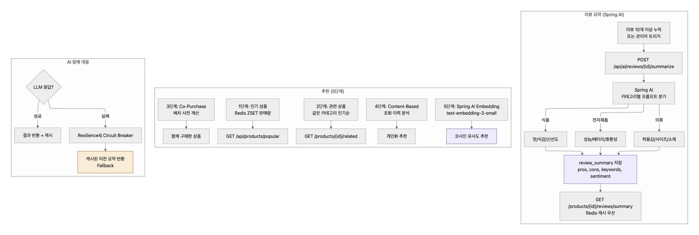

## Flow 9: 구독 라이프사이클

<details>
<summary>구독 라이프사이클</summary>
<div markdown="1">

```Mermaid

flowchart TD
    A["GET /api/subscriptions/info<br/>구독 상품 정보 조회"] --> B["POST /api/subscriptions"]
    B --> C["subscription 생성<br/>status: ACTIVE<br/>startAt: now<br/>endAt: +30일"]

    C --> D["구독 혜택 적용<br/>무료배송<br/>추가 5% 할인"]

    D --> E{만료 전 해지?}
    E -->|해지| F["PATCH /api/subscriptions/cancel"]
    F --> G["status: CANCELLED<br/>endAt까지 혜택 유지"]

    E -->|유지| H{"endAt 도래?"}
    H -->|만료| I["@Scheduled 매일 00:00<br/>status: EXPIRED"]
    H -->|갱신| J["자동 결제<br/>기존 구독 갱신<br/>endAt: +30일 연장<br/>nextPaymentDate: +30일 연장"]

    G --> K["endAt 이후<br/>혜택 종료"]
    I --> L["GET /subscriptions/me<br/>history에 이력 보존"]

    style C fill:#EAF3DE,stroke:#639922
    style G fill:#FAEEDA,stroke:#854F0B
    style I fill:#FCEBEB,stroke:#A32D2D

```

</div>
</details>

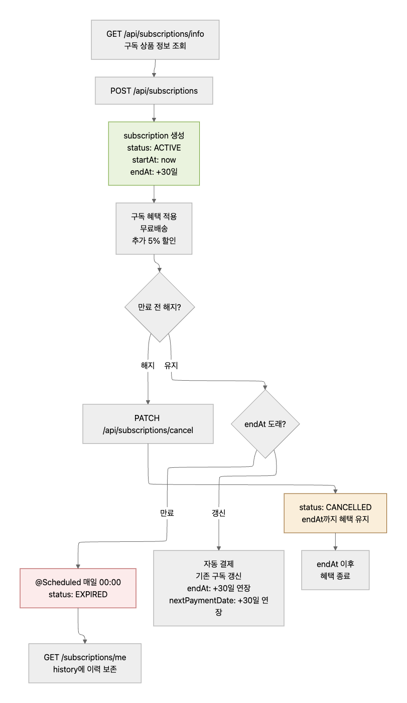

### 구독 상태 머신

<details>
<summary>구독 상태 머신</summary>
<div markdown="1">

```Mermaid

stateDiagram-v2
    [*] --> ACTIVE : POST /api/subscriptions

    ACTIVE --> CANCELLED : PATCH /api/subscriptions/cancel
    ACTIVE --> EXPIRED : endAt 도래 (스케줄러)
    ACTIVE --> ACTIVE : 자동 갱신 (기존 구독 연장)

    CANCELLED --> EXPIRED : endAt 도래

    note right of ACTIVE : 혜택 적용 중
    note right of CANCELLED : endAt까지 혜택 유지
    note right of EXPIRED : 혜택 종료, 재가입 가능

```

</div>
</details>

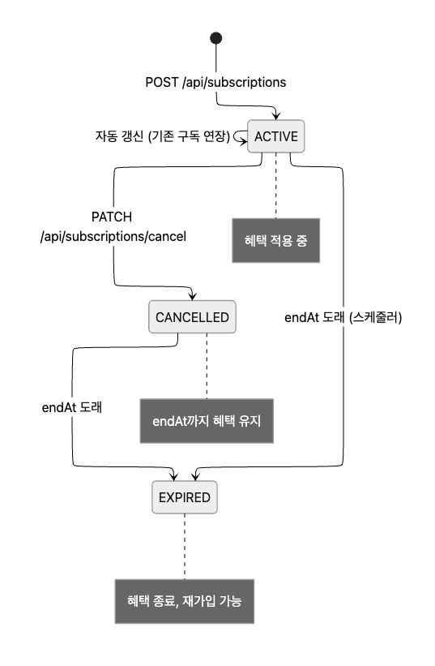

## Flow 10: Outbox → Kafka 이벤트 파이프라인

<details>
<summary> Outbox → Kafka 이벤트 파이프라인</summary>
<div markdown="1">

```Mermaid

flowchart TD
    subgraph "이벤트 발행 (Producer)"
        A["주문/결제/배송 등<br/>비즈니스 로직"] --> B["@Transactional 내<br/>event_outbox INSERT<br/>status: PENDING"]
        B --> C["TX Commit"]
    end

    subgraph "3-Phase 스케줄러 (매 5초)"
        D["Phase 1: 짧은 TX<br/>PENDING → PROCESSING<br/>SKIP LOCKED"] --> E["Phase 2: TX 없음<br/>Kafka send.get(10s)<br/>DB 커넥션 미점유"]
        E --> F{"전송 성공?"}
        F -->|성공| G["Phase 3: 짧은 TX<br/>status → SENT"]
        F -->|실패| H["Phase 3: 짧은 TX<br/>status → PENDING<br/>retryCount++"]
        H --> I{"retryCount > 5?"}
        I -->|초과| J["status → DEAD<br/>DLT 토픽 전송"]
        I -->|미초과| K["다음 주기에 재시도"]
    end

    subgraph "고착 복구"
        L["PROCESSING 상태<br/>5분 이상 체류"] --> M["자동 재선점<br/>→ PENDING 복원"]
    end

    subgraph "Consumer (독립적 소비)"
        N["Kafka 토픽"] --> O["NotificationConsumer<br/>알림 발송"]
        N --> P["PointConsumer<br/>포인트 적립"]
        N --> Q["CouponDbConsumer<br/>쿠폰 DB 저장"]
        N --> R["ReviewSummaryConsumer<br/>AI 요약 트리거"]
    end

    C --> D
    G --> N

    style B fill:#FAEEDA,stroke:#854F0B
    style J fill:#FCEBEB,stroke:#A32D2D
    style N fill:#EEEDFE,stroke:#534AB7

```

</div>
</details>

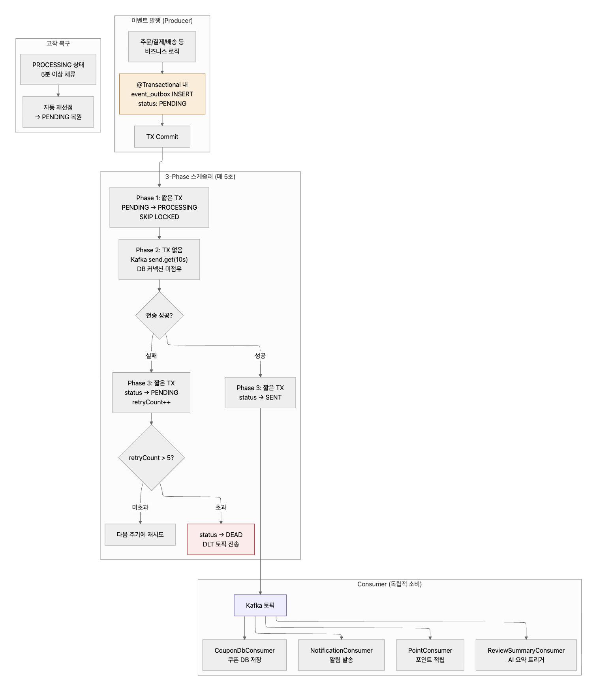

### Kafka 토픽 목록

<details>
<summary>Kafka 토픽 목록</summary>
<div markdown="1">

```Mermaid

flowchart LR
    subgraph "토픽"
        T1["order-paid"]
        T2["order-cancelled"]
        T3["order-confirmed"]
        T4["order-rejected"]
        T5["shipping-started"]
        T6["shipping-delivered"]
        T7["seller-approved"]
        T8["seller-rejected"]
        T9["product-approved"]
        T10["product-rejected"]
        T11["coupon-issued"]
    end

    subgraph "Consumer Groups"
        CG1["notification-group"]
        CG2["point-group"]
        CG3["coupon-db-group"]
    end

    T1 --> CG1
    T2 --> CG1
    T3 --> CG1
    T4 --> CG1
    T5 --> CG1
    T6 --> CG1
    T6 --> CG2
    T7 --> CG1
    T8 --> CG1
    T9 --> CG1
    T10 --> CG1
    T11 --> CG3

    style CG1 fill:#E6F1FB,stroke:#185FA5
    style CG2 fill:#EAF3DE,stroke:#639922
    style CG3 fill:#FAEEDA,stroke:#854F0B

```

</div>
</details>

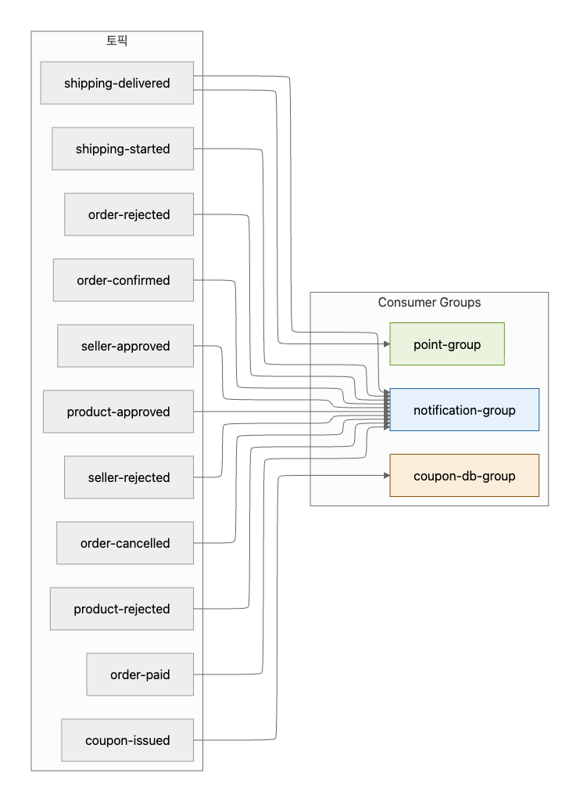

### 스케줄러 전체 맵

<details>
<summary>스케줄러 전체 맵</summary>
<div markdown="1">

```Mermaid

flowchart TD
    subgraph "매 5초"
        S1["Outbox 3-Phase<br/>PENDING → Kafka 전송"]
    end

    subgraph "매 5분"
        S2["인기 상품 갱신<br/>Redis ZSET"]
        S3["조회수 DB 반영<br/>Redis → MySQL"]
    end

    subgraph "매일 00:00"
        S4["구독 만료 처리<br/>ACTIVE → EXPIRED"]
        S5["인기 검색어 리셋<br/>Redis RENAME"]
    end

    subgraph "매일 01:00"
        S6["쿠폰 만료 처리<br/>AVAILABLE → EXPIRED"]
    end

    subgraph "매일 02:00"
        S7["Outbox 정리<br/>7일 이전 SENT 삭제"]
    end

    subgraph "매일 03:00"
        S8["포인트 만료 처리<br/>expire_at 체크"]
        S9["포인트 정합성 검증<br/>balance vs SUM"]
    end

    S1 -.->|SKIP LOCKED| S10["멀티 인스턴스 안전"]
    S4 -.->|SKIP LOCKED| S10
    S8 -.->|SKIP LOCKED| S10

    style S1 fill:#FAECE7,stroke:#993C1D
    style S10 fill:#E6F1FB,stroke:#185FA5

```

</div>
</details>

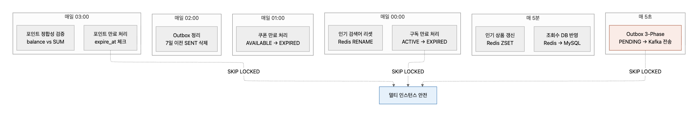

## Flow 11: 주문 취소 플로우 (보상 트랜잭션)

<details>
<summary>주문 취소 플로우 (보상 트랜잭션)</summary>
<div markdown="1">

```Mermaid

flowchart TD
    A["POST /api/orders/{id}/cancel<br/>reason: 단순 변심"] --> B{"order.status 체크<br/>@Version 낙관적 락"}

    B -->|PENDING_PAYMENT| C["즉시 취소 가능"]
    B -->|PAID + order_item ORDERED| D["취소 가능"]
    B -->|CONFIRMED 이후| E["400 ORDER_008<br/>취소 불가"]

    C --> F["@Transactional"]
    D --> F

    subgraph TX ["보상 트랜잭션"]
        F --> G["재고 복구<br/>ProductItem.stock += quantity"]
        G --> H{"포인트 사용했나?"}
        H -->|사용| I["point.balance += usedPoint<br/>point_history: REFUND"]
        H -->|미사용| J[skip]
        I --> K{"쿠폰 사용했나?"}
        J --> K
        K -->|사용 + 만료 전| L["user_coupon: AVAILABLE"]
        K -->|사용 + 만료 후| M["user_coupon: EXPIRED"]
        K -->|미사용| N[skip]
        L --> O["order.status = CANCELLED"]
        M --> O
        N --> O
        O --> P["Outbox INSERT<br/>topic: order-cancelled"]
    end

    P --> Q["200 OK<br/>refundAmount, restoredPoint,<br/>restoredCoupon"]

    style E fill:#FCEBEB,stroke:#A32D2D
    style O fill:#EAF3DE,stroke:#639922

```

</div>
</details>

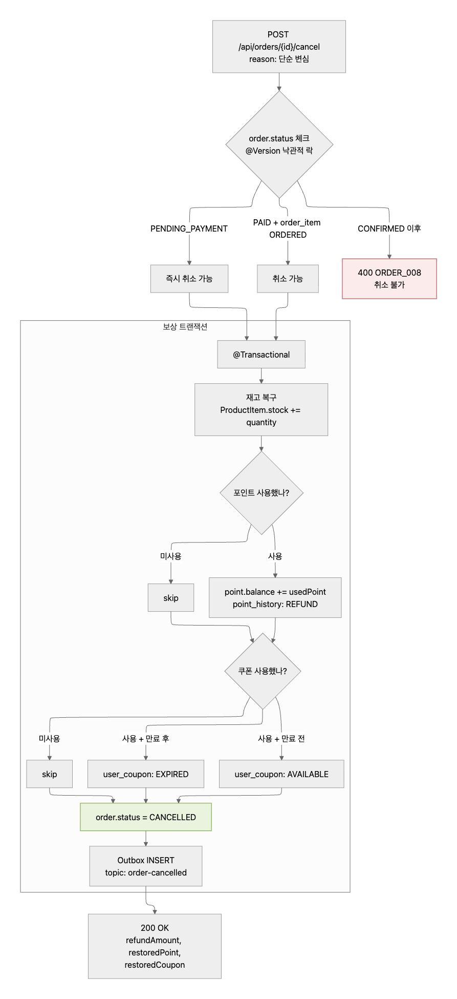

## Flow 12: 전체 이벤트 연결 맵

<details>
<summary>전체 이벤트 연결 맵</summary>
<div markdown="1">

```Mermaid

flowchart LR
    subgraph "구매자"
        B1["주문 생성"]
        B2["결제 승인"]
        B3["주문 취소"]
    end

    subgraph "판매자"
        S1["주문 확인"]
        S2["주문 거절"]
        S3["배송 시작"]
        S4["배송 완료"]
    end

    subgraph "관리자"
        A1["판매자 승인/반려"]
        A2["상품 승인/반려"]
    end

    subgraph "Kafka"
        K1["order-paid"]
        K2["order-cancelled"]
        K3["order-confirmed"]
        K4["order-rejected"]
        K5["shipping-started"]
        K6["shipping-delivered"]
        K7["seller-approved/rejected"]
        K8["product-approved/rejected"]
        K9["coupon-issued"]
    end

    subgraph "Consumer"
        C1["알림"]
        C2["포인트 적립"]
        C3["쿠폰 DB"]
    end

    B2 --> K1
    B3 --> K2
    S1 --> K3
    S2 --> K4
    S3 --> K5
    S4 --> K6
    A1 --> K7
    A2 --> K8

    K1 --> C1
    K2 --> C1
    K3 --> C1
    K4 --> C1
    K5 --> C1
    K6 --> C1
    K6 --> C2
    K7 --> C1
    K8 --> C1
    K9 --> C3

```

</div>
</details>

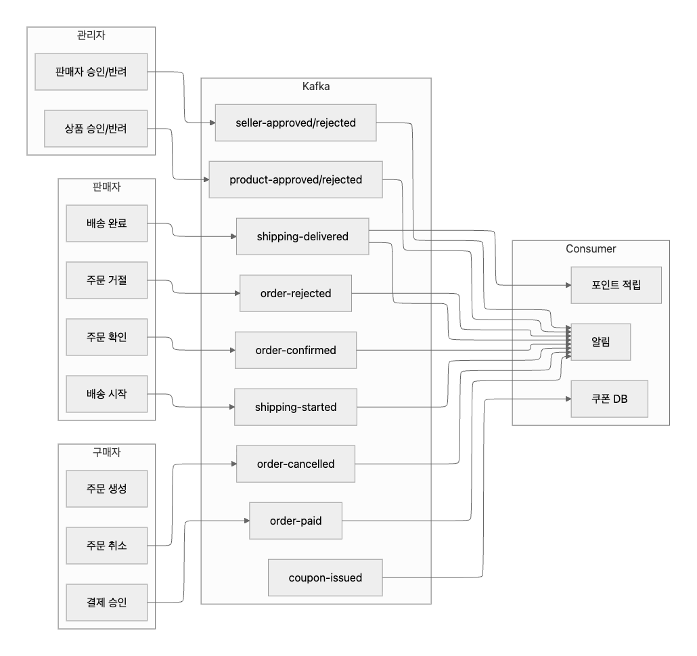