# 도메인별 시퀀스 다이어그램

> One-Stop 프로젝트의 주요 도메인 흐름을 Mermaid 시퀀스 다이어그램으로 정리한 문서입니다.  
> 각 시퀀스는 기능 호출 흐름뿐 아니라 Redis, DB, Kafka, 외부 API 등 주요 의존성과 장애 대응 포인트를 함께 표현합니다.

---

## 1. 문서 목적

본 문서는 One-Stop 프로젝트의 핵심 도메인별 처리 흐름을 시각적으로 설명하기 위한 자료입니다.

주요 목적은 다음과 같습니다.

- 도메인별 요청 처리 흐름을 한눈에 파악한다.
- Controller, Service, Repository, Redis, DB, Kafka, 외부 API 간 책임을 구분한다.
- 장애 시나리오 Runbook과 연결하여 어느 지점에서 장애가 발생할 수 있는지 파악한다.
- 발표, README, 기술 문서, 면접 설명 자료로 활용한다.

---

## 2. 전체 요청 흐름

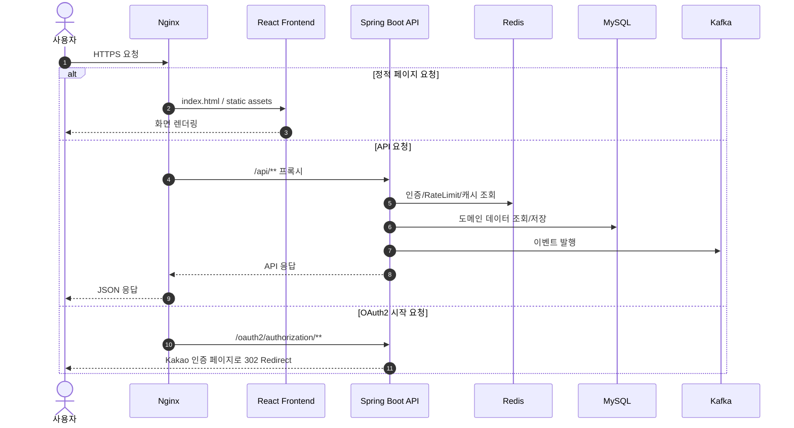
```mermaid
sequenceDiagram
    autonumber
    actor User as 사용자
    participant Nginx as Nginx
    participant FE as React Frontend
    participant BE as Spring Boot API
    participant Redis as Redis
    participant DB as MySQL
    participant Kafka as Kafka

    User->>Nginx: HTTPS 요청
    alt 정적 페이지 요청
        Nginx->>FE: index.html / static assets
        FE-->>User: 화면 렌더링
    else API 요청
        Nginx->>BE: /api/** 프록시
        BE->>Redis: 인증/RateLimit/캐시 조회
        BE->>DB: 도메인 데이터 조회/저장
        BE->>Kafka: 이벤트 발행
        BE-->>Nginx: API 응답
        Nginx-->>User: JSON 응답
    else OAuth2 시작 요청
        Nginx->>BE: /oauth2/authorization/**
        BE-->>User: Kakao 인증 페이지로 302 Redirect
    end
```

### 핵심 포인트

- `/api/**`는 백엔드로 전달합니다.
- `/oauth2/authorization/**`와 `/login/oauth2/**`는 백엔드로 전달합니다.
- `/oauth2/callback`은 React Router가 처리해야 하므로 프론트로 전달합니다.
- Redis는 인증, Rate Limit, Refresh Token, 쿠폰 발급 등에 사용됩니다.
- Kafka는 결제/주문/알림 등 비동기 이벤트 처리에 사용됩니다.

---

# Part 1. 인증/Auth/Security/User 도메인

---

## 3. 일반 로그인 시퀀스

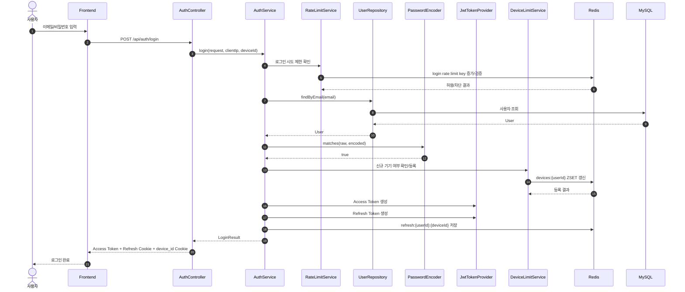
```mermaid
sequenceDiagram
    autonumber
    actor User as 사용자
    participant FE as Frontend
    participant AuthController as AuthController
    participant AuthService as AuthService
    participant RateLimit as RateLimitService
    participant UserRepo as UserRepository
    participant PasswordEncoder as PasswordEncoder
    participant JwtProvider as JwtTokenProvider
    participant DeviceService as DeviceLimitService
    participant Redis as Redis
    participant DB as MySQL

    User->>FE: 이메일/비밀번호 입력
    FE->>AuthController: POST /api/auth/login
    AuthController->>AuthService: login(request, clientIp, deviceId)

    AuthService->>RateLimit: 로그인 시도 제한 확인
    RateLimit->>Redis: login rate limit key 증가/검증
    Redis-->>RateLimit: 허용/차단 결과

    AuthService->>UserRepo: findByEmail(email)
    UserRepo->>DB: 사용자 조회
    DB-->>UserRepo: User
    UserRepo-->>AuthService: User

    AuthService->>PasswordEncoder: matches(raw, encoded)
    PasswordEncoder-->>AuthService: true

    AuthService->>DeviceService: 신규 기기 여부 확인/등록
    DeviceService->>Redis: devices:{userId} ZSET 갱신
    Redis-->>DeviceService: 등록 결과

    AuthService->>JwtProvider: Access Token 생성
    AuthService->>JwtProvider: Refresh Token 생성
    AuthService->>Redis: refresh:{userId}:{deviceId} 저장

    AuthService-->>AuthController: LoginResult
    AuthController-->>FE: Access Token + Refresh Cookie + device_id Cookie
    FE-->>User: 로그인 완료
```

### 장애 포인트

- Redis 장애 시 로그인 Rate Limit 또는 Refresh Token 저장 실패
- device_id 쿠키 누락 시 Refresh Token key 불일치
- 비밀번호 검증 실패 누적 시 계정 또는 IP 차단
- 신규 기기 등록 실패 시 다중 기기 제한 우회 가능

---

## 4. Refresh Token Rotation 시퀀스

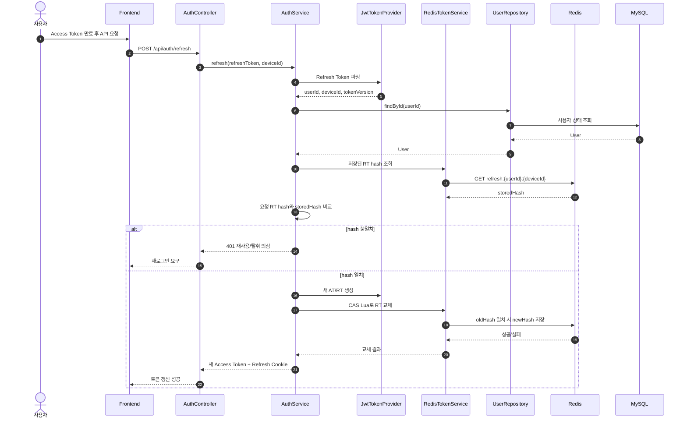
```mermaid
sequenceDiagram
    autonumber
    actor User as 사용자
    participant FE as Frontend
    participant AuthController as AuthController
    participant AuthService as AuthService
    participant JwtProvider as JwtTokenProvider
    participant RedisToken as RedisTokenService
    participant UserRepo as UserRepository
    participant Redis as Redis
    participant DB as MySQL

    User->>FE: Access Token 만료 후 API 요청
    FE->>AuthController: POST /api/auth/refresh
    AuthController->>AuthService: refresh(refreshToken, deviceId)

    AuthService->>JwtProvider: Refresh Token 파싱
    JwtProvider-->>AuthService: userId, deviceId, tokenVersion

    AuthService->>UserRepo: findById(userId)
    UserRepo->>DB: 사용자 상태 조회
    DB-->>UserRepo: User
    UserRepo-->>AuthService: User

    AuthService->>RedisToken: 저장된 RT hash 조회
    RedisToken->>Redis: GET refresh:{userId}:{deviceId}
    Redis-->>RedisToken: storedHash

    AuthService->>AuthService: 요청 RT hash와 storedHash 비교
    alt hash 불일치
        AuthService-->>AuthController: 401 재사용/탈취 의심
        AuthController-->>FE: 재로그인 요구
    else hash 일치
        AuthService->>JwtProvider: 새 AT/RT 생성
        AuthService->>RedisToken: CAS Lua로 RT 교체
        RedisToken->>Redis: oldHash 일치 시 newHash 저장
        Redis-->>RedisToken: 성공/실패
        RedisToken-->>AuthService: 교체 결과
        AuthService-->>AuthController: 새 Access Token + Refresh Cookie
        AuthController-->>FE: 토큰 갱신 성공
    end
```

### 장애 포인트

- 동일 기기에서 refresh 요청이 동시에 발생하면 CAS 실패 가능
- Redis 장애 시 Refresh Token 검증 불가
- 탈취된 Refresh Token 재사용 시 hash 불일치로 차단
- tokenVersion 불일치 시 기존 토큰 무효화

---

## 5. OAuth2 카카오 로그인 시퀀스

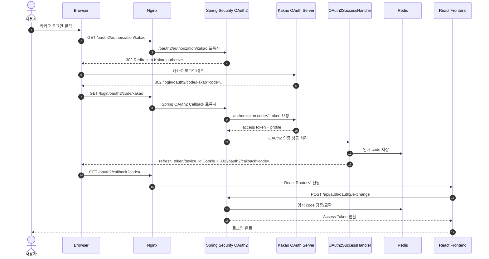
```mermaid
sequenceDiagram
    autonumber
    actor User as 사용자
    participant Browser as Browser
    participant Nginx as Nginx
    participant BE as Spring Security OAuth2
    participant Kakao as Kakao OAuth Server
    participant SuccessHandler as OAuth2SuccessHandler
    participant Redis as Redis
    participant FE as React Frontend

    User->>Browser: 카카오 로그인 클릭
    Browser->>Nginx: GET /oauth2/authorization/kakao
    Nginx->>BE: /oauth2/authorization/kakao 프록시
    BE-->>Browser: 302 Redirect to Kakao authorize

    Browser->>Kakao: 카카오 로그인/동의
    Kakao-->>Browser: 302 /login/oauth2/code/kakao?code=...

    Browser->>Nginx: GET /login/oauth2/code/kakao
    Nginx->>BE: Spring OAuth2 Callback 프록시
    BE->>Kakao: authorization code로 token 요청
    Kakao-->>BE: access token + profile

    BE->>SuccessHandler: OAuth2 인증 성공 처리
    SuccessHandler->>Redis: 임시 code 저장
    SuccessHandler-->>Browser: refresh_token/device_id Cookie + 302 /oauth2/callback?code=...

    Browser->>Nginx: GET /oauth2/callback?code=...
    Nginx->>FE: React Router로 전달
    FE->>BE: POST /api/auth/oauth2/exchange
    BE->>Redis: 임시 code 검증/교환
    BE-->>FE: Access Token 반환
    FE-->>User: 로그인 완료
```

### Nginx 라우팅 기준

```text
/oauth2/authorization/**  → Backend
/login/oauth2/**          → Backend
/oauth2/callback          → Frontend
```

### 장애 포인트

- Kakao Developers redirect URI 불일치 시 400 발생
- 운영 환경에서 `{baseUrl}` 사용 시 http redirect_uri 생성 가능
- `/oauth2/callback`이 백엔드로 가면 application/json 또는 500 발생
- 프론트의 `/api/auth/oauth2/exchange` 미구현 시 로그인 완료 실패

---

## 6. 회원가입 시퀀스

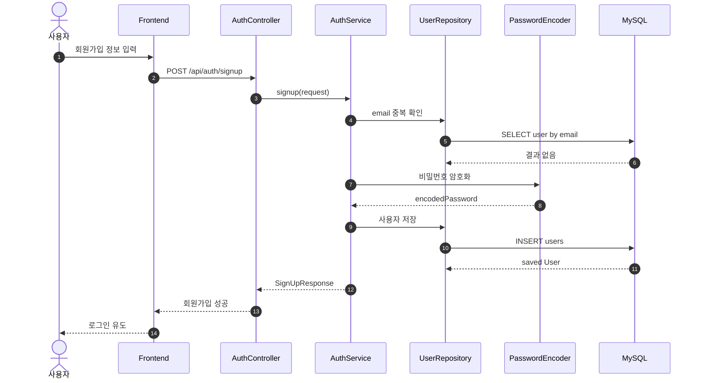
```mermaid
sequenceDiagram
    autonumber
    actor User as 사용자
    participant FE as Frontend
    participant AuthController as AuthController
    participant AuthService as AuthService
    participant UserRepo as UserRepository
    participant PasswordEncoder as PasswordEncoder
    participant DB as MySQL

    User->>FE: 회원가입 정보 입력
    FE->>AuthController: POST /api/auth/signup
    AuthController->>AuthService: signup(request)

    AuthService->>UserRepo: email 중복 확인
    UserRepo->>DB: SELECT user by email
    DB-->>UserRepo: 결과 없음

    AuthService->>PasswordEncoder: 비밀번호 암호화
    PasswordEncoder-->>AuthService: encodedPassword

    AuthService->>UserRepo: 사용자 저장
    UserRepo->>DB: INSERT users
    DB-->>UserRepo: saved User

    AuthService-->>AuthController: SignUpResponse
    AuthController-->>FE: 회원가입 성공
    FE-->>User: 로그인 유도
```

### 장애 포인트

- 이메일 중복 검증 누락 시 중복 계정 발생
- ADMIN/SUPER_ADMIN 가입 허용 시 권한 상승 위험
- 주소/상세주소, 은행명/계좌번호 필드 검증 누락 시 사용자 데이터 품질 저하

---

## 7. 권한 변경 및 토큰 무효화 시퀀스

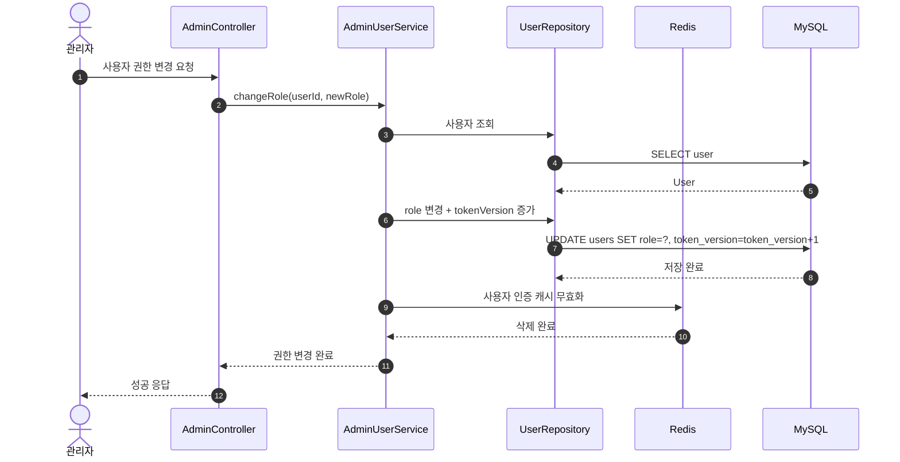
```mermaid
sequenceDiagram
    autonumber
    actor Admin as 관리자
    participant AdminController as AdminController
    participant AdminService as AdminUserService
    participant UserRepo as UserRepository
    participant Redis as Redis
    participant DB as MySQL

    Admin->>AdminController: 사용자 권한 변경 요청
    AdminController->>AdminService: changeRole(userId, newRole)

    AdminService->>UserRepo: 사용자 조회
    UserRepo->>DB: SELECT user
    DB-->>UserRepo: User

    AdminService->>UserRepo: role 변경 + tokenVersion 증가
    UserRepo->>DB: UPDATE users SET role=?, token_version=token_version+1
    DB-->>UserRepo: 저장 완료

    AdminService->>Redis: 사용자 인증 캐시 무효화
    Redis-->>AdminService: 삭제 완료

    AdminService-->>AdminController: 권한 변경 완료
    AdminController-->>Admin: 성공 응답
```

### 장애 포인트

- 권한 변경 후 tokenVersion 증가 누락 시 기존 토큰이 계속 유효
- 인증 캐시 무효화 지연 시 일시적으로 이전 권한 사용 가능
- 관리자 감사 로그 누락 시 추적성 저하

---

# Part 2. 주문/결제/배송 도메인

---

## 8. 주문 생성 시퀀스

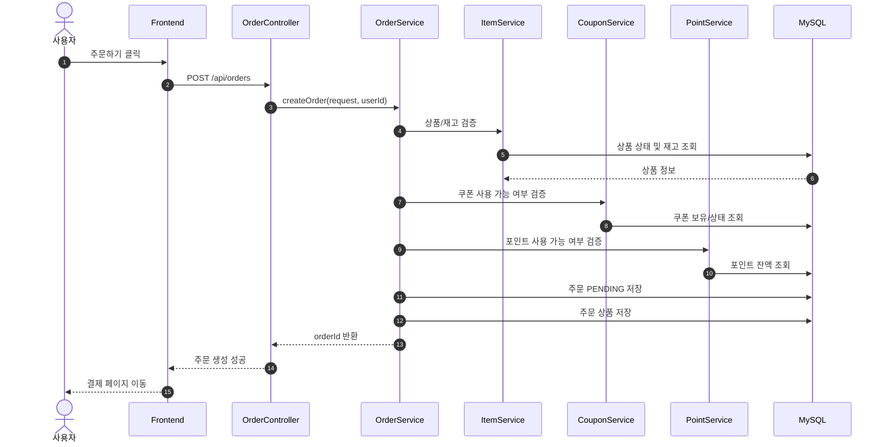
```mermaid
sequenceDiagram
    autonumber
    actor User as 사용자
    participant FE as Frontend
    participant OrderController as OrderController
    participant OrderService as OrderService
    participant ItemService as ItemService
    participant CouponService as CouponService
    participant PointService as PointService
    participant DB as MySQL

    User->>FE: 주문하기 클릭
    FE->>OrderController: POST /api/orders
    OrderController->>OrderService: createOrder(request, userId)

    OrderService->>ItemService: 상품/재고 검증
    ItemService->>DB: 상품 상태 및 재고 조회
    DB-->>ItemService: 상품 정보

    OrderService->>CouponService: 쿠폰 사용 가능 여부 검증
    CouponService->>DB: 쿠폰 보유/상태 조회

    OrderService->>PointService: 포인트 사용 가능 여부 검증
    PointService->>DB: 포인트 잔액 조회

    OrderService->>DB: 주문 PENDING 저장
    OrderService->>DB: 주문 상품 저장
    OrderService-->>OrderController: orderId 반환
    OrderController-->>FE: 주문 생성 성공
    FE-->>User: 결제 페이지 이동
```

### 장애 포인트

- 주문은 생성됐지만 결제 페이지 이동 실패
- 쿠폰/포인트 검증과 주문 저장 사이 상태 불일치
- 재고 검증 후 결제 전 품절 가능성
- 장시간 PENDING 주문 누적

---

## 9. 결제 승인 및 내부 상태 변경 시퀀스

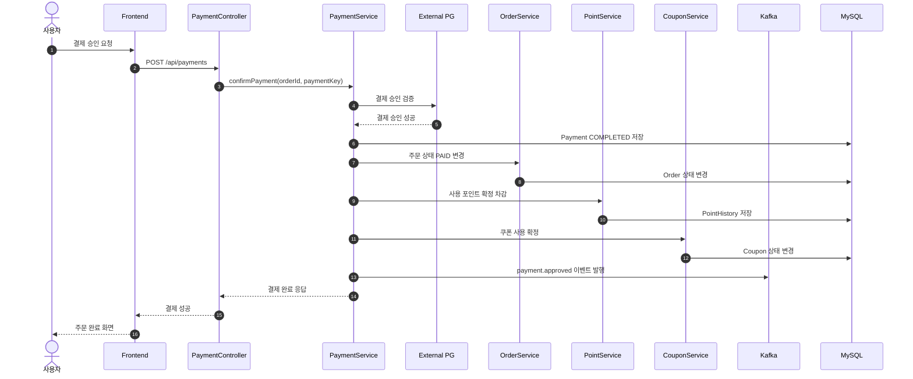
```mermaid
sequenceDiagram
    autonumber
    actor User as 사용자
    participant FE as Frontend
    participant PaymentController as PaymentController
    participant PaymentService as PaymentService
    participant PG as External PG
    participant OrderService as OrderService
    participant PointService as PointService
    participant CouponService as CouponService
    participant Kafka as Kafka
    participant DB as MySQL

    User->>FE: 결제 승인 요청
    FE->>PaymentController: POST /api/payments
    PaymentController->>PaymentService: confirmPayment(orderId, paymentKey)

    PaymentService->>PG: 결제 승인 검증
    PG-->>PaymentService: 결제 승인 성공

    PaymentService->>DB: Payment COMPLETED 저장
    PaymentService->>OrderService: 주문 상태 PAID 변경
    OrderService->>DB: Order 상태 변경

    PaymentService->>PointService: 사용 포인트 확정 차감
    PointService->>DB: PointHistory 저장

    PaymentService->>CouponService: 쿠폰 사용 확정
    CouponService->>DB: Coupon 상태 변경

    PaymentService->>Kafka: payment.approved 이벤트 발행
    PaymentService-->>PaymentController: 결제 완료 응답
    PaymentController-->>FE: 결제 성공
    FE-->>User: 주문 완료 화면
```

### 장애 포인트

- PG 결제는 성공했지만 내부 DB 저장 실패
- 주문 상태와 결제 상태 불일치
- 포인트/쿠폰 사용 이력 누락
- Kafka 이벤트 발행 실패로 알림 누락
- 보상 트랜잭션 또는 환불 필요

---

## 10. 결제 실패 보상 트랜잭션 시퀀스

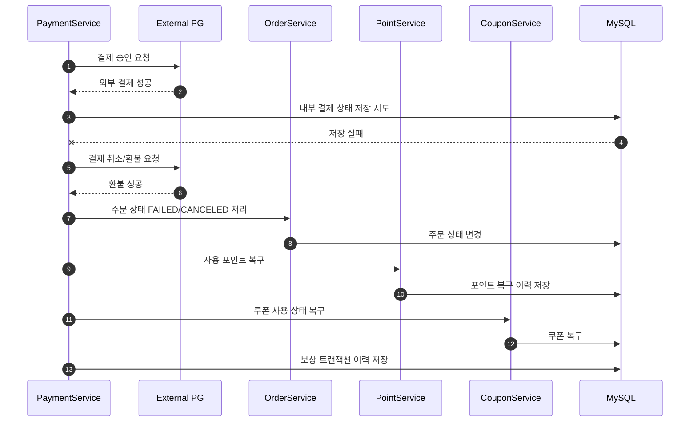
```mermaid
sequenceDiagram
    autonumber
    participant PaymentService as PaymentService
    participant PG as External PG
    participant OrderService as OrderService
    participant PointService as PointService
    participant CouponService as CouponService
    participant DB as MySQL

    PaymentService->>PG: 결제 승인 요청
    PG-->>PaymentService: 외부 결제 성공

    PaymentService->>DB: 내부 결제 상태 저장 시도
    DB--xPaymentService: 저장 실패

    PaymentService->>PG: 결제 취소/환불 요청
    PG-->>PaymentService: 환불 성공

    PaymentService->>OrderService: 주문 상태 FAILED/CANCELED 처리
    OrderService->>DB: 주문 상태 변경

    PaymentService->>PointService: 사용 포인트 복구
    PointService->>DB: 포인트 복구 이력 저장

    PaymentService->>CouponService: 쿠폰 사용 상태 복구
    CouponService->>DB: 쿠폰 복구

    PaymentService->>DB: 보상 트랜잭션 이력 저장
```

### 장애 포인트

- 보상 트랜잭션 중 PG 환불 실패
- 내부 실패 이력 저장 누락
- 포인트/쿠폰 복구 누락
- 같은 결제 건 재처리 시 중복 환불 위험

---

## 11. 배송 상태 변경 시퀀스

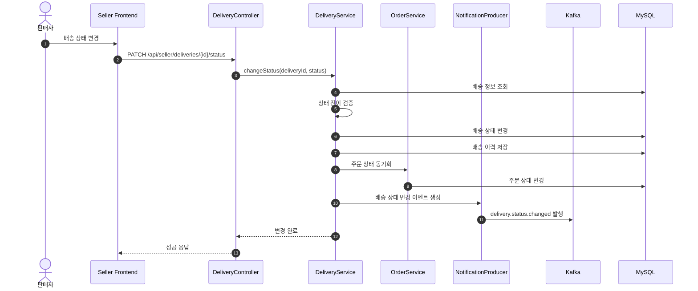
```mermaid
sequenceDiagram
    autonumber
    actor Seller as 판매자
    participant FE as Seller Frontend
    participant DeliveryController as DeliveryController
    participant DeliveryService as DeliveryService
    participant OrderService as OrderService
    participant NotificationProducer as NotificationProducer
    participant Kafka as Kafka
    participant DB as MySQL

    Seller->>FE: 배송 상태 변경
    FE->>DeliveryController: PATCH /api/seller/deliveries/{id}/status
    DeliveryController->>DeliveryService: changeStatus(deliveryId, status)

    DeliveryService->>DB: 배송 정보 조회
    DeliveryService->>DeliveryService: 상태 전이 검증
    DeliveryService->>DB: 배송 상태 변경
    DeliveryService->>DB: 배송 이력 저장

    DeliveryService->>OrderService: 주문 상태 동기화
    OrderService->>DB: 주문 상태 변경

    DeliveryService->>NotificationProducer: 배송 상태 변경 이벤트 생성
    NotificationProducer->>Kafka: delivery.status.changed 발행

    DeliveryService-->>DeliveryController: 변경 완료
    DeliveryController-->>FE: 성공 응답
```

### 장애 포인트

- 잘못된 상태 전이 허용
- 배송 이력 저장 누락
- 주문 상태와 배송 상태 불일치
- 배송 알림 누락

---

# Part 3. 상품/재고/장바구니/판매자 도메인

---

## 12. 상품 등록 시퀀스

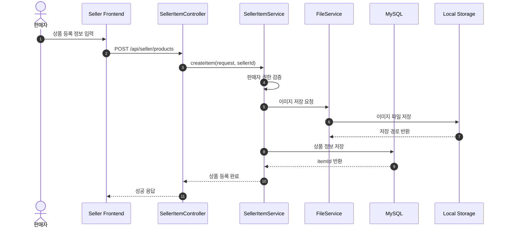
```mermaid
sequenceDiagram
    autonumber
    actor Seller as 판매자
    participant FE as Seller Frontend
    participant SellerController as SellerItemController
    participant SellerService as SellerItemService
    participant FileService as FileService
    participant DB as MySQL
    participant Storage as Local Storage

    Seller->>FE: 상품 등록 정보 입력
    FE->>SellerController: POST /api/seller/products
    SellerController->>SellerService: createItem(request, sellerId)

    SellerService->>SellerService: 판매자 권한 검증
    SellerService->>FileService: 이미지 저장 요청
    FileService->>Storage: 이미지 파일 저장
    Storage-->>FileService: 저장 경로 반환

    SellerService->>DB: 상품 정보 저장
    DB-->>SellerService: itemId 반환

    SellerService-->>SellerController: 상품 등록 완료
    SellerController-->>FE: 성공 응답
```

### 장애 포인트

- 이미지 저장 성공 후 DB 저장 실패
- DB 저장 성공 후 이미지 접근 경로 오류
- 판매자 권한 검증 누락
- 상품 상태 초기값 오류

---

## 13. 상품 수정 및 판매 상태 변경 시퀀스

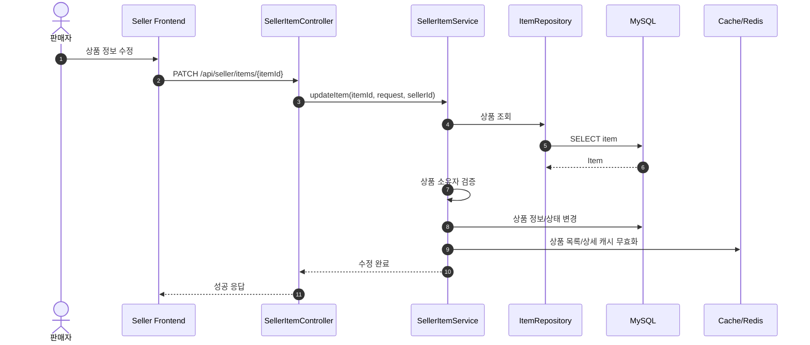
```mermaid
sequenceDiagram
    autonumber
    actor Seller as 판매자
    participant FE as Seller Frontend
    participant SellerController as SellerItemController
    participant SellerService as SellerItemService
    participant ItemRepo as ItemRepository
    participant DB as MySQL
    participant Cache as Cache/Redis

    Seller->>FE: 상품 정보 수정
    FE->>SellerController: PATCH /api/seller/items/{itemId}
    SellerController->>SellerService: updateItem(itemId, request, sellerId)

    SellerService->>ItemRepo: 상품 조회
    ItemRepo->>DB: SELECT item
    DB-->>ItemRepo: Item

    SellerService->>SellerService: 상품 소유자 검증
    SellerService->>DB: 상품 정보/상태 변경
    SellerService->>Cache: 상품 목록/상세 캐시 무효화

    SellerService-->>SellerController: 수정 완료
    SellerController-->>FE: 성공 응답
```

### 장애 포인트

- 판매자 소유권 검증 누락
- 품절/판매중지 상태가 목록에 계속 노출
- 캐시 무효화 누락
- 상품 수정과 이미지 수정 간 불일치

---

## 14. 재고 차감 시퀀스

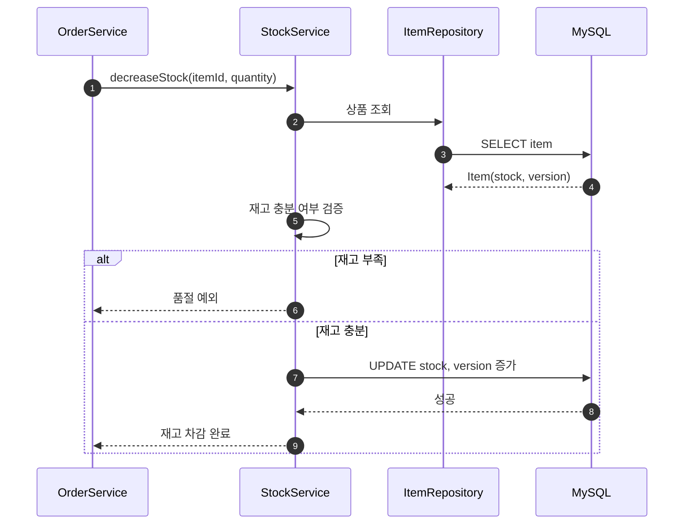
```mermaid
sequenceDiagram
    autonumber
    participant OrderService as OrderService
    participant StockService as StockService
    participant ItemRepo as ItemRepository
    participant DB as MySQL

    OrderService->>StockService: decreaseStock(itemId, quantity)
    StockService->>ItemRepo: 상품 조회
    ItemRepo->>DB: SELECT item
    DB-->>ItemRepo: Item(stock, version)

    StockService->>StockService: 재고 충분 여부 검증

    alt 재고 부족
        StockService-->>OrderService: 품절 예외
    else 재고 충분
        StockService->>DB: UPDATE stock, version 증가
        DB-->>StockService: 성공
        StockService-->>OrderService: 재고 차감 완료
    end
```

### 장애 포인트

- 동시 주문으로 초과 판매 발생
- 낙관적 락 충돌 시 재시도 정책 부재
- 결제 실패 후 재고 복구 누락

---

## 15. 장바구니 추가 및 병합 시퀀스

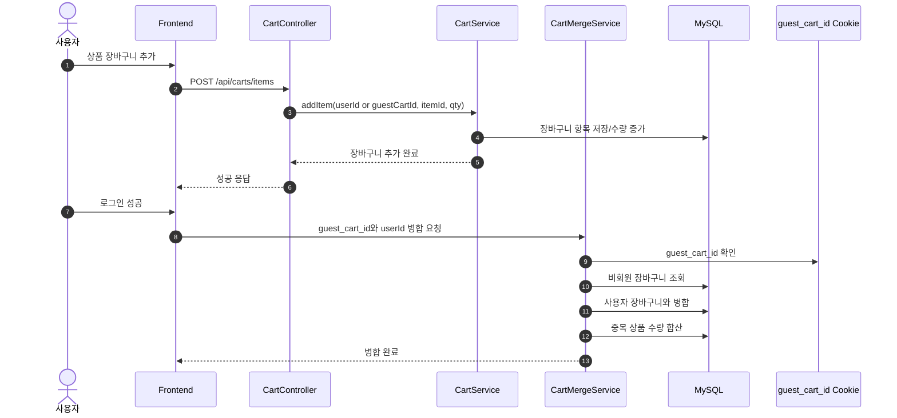
```mermaid
sequenceDiagram
    autonumber
    actor User as 사용자
    participant FE as Frontend
    participant CartController as CartController
    participant CartService as CartService
    participant CartMergeService as CartMergeService
    participant DB as MySQL
    participant Cookie as guest_cart_id Cookie

    User->>FE: 상품 장바구니 추가
    FE->>CartController: POST /api/carts/items
    CartController->>CartService: addItem(userId or guestCartId, itemId, qty)
    CartService->>DB: 장바구니 항목 저장/수량 증가
    CartService-->>CartController: 장바구니 추가 완료
    CartController-->>FE: 성공 응답

    User->>FE: 로그인 성공
    FE->>CartMergeService: guest_cart_id와 userId 병합 요청
    CartMergeService->>Cookie: guest_cart_id 확인
    CartMergeService->>DB: 비회원 장바구니 조회
    CartMergeService->>DB: 사용자 장바구니와 병합
    CartMergeService->>DB: 중복 상품 수량 합산
    CartMergeService-->>FE: 병합 완료
```

### 장애 포인트

- 동일 userId + itemId 중복 row 발생
- 비회원 장바구니 항목 누락
- guest_cart_id 쿠키 삭제/유지 정책 불일치
- 병합 재시도 시 중복 합산

---

## 16. 판매자 대시보드 조회 시퀀스

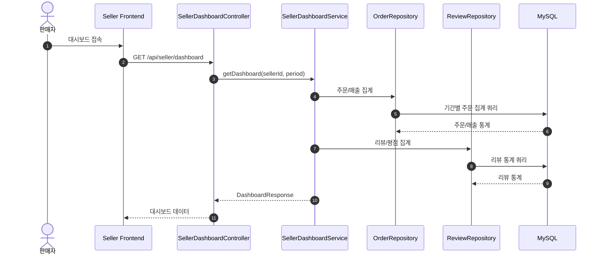
```mermaid
sequenceDiagram
    autonumber
    actor Seller as 판매자
    participant FE as Seller Frontend
    participant DashboardController as SellerDashboardController
    participant DashboardService as SellerDashboardService
    participant OrderRepo as OrderRepository
    participant ReviewRepo as ReviewRepository
    participant DB as MySQL

    Seller->>FE: 대시보드 접속
    FE->>DashboardController: GET /api/seller/dashboard
    DashboardController->>DashboardService: getDashboard(sellerId, period)

    DashboardService->>OrderRepo: 주문/매출 집계
    OrderRepo->>DB: 기간별 주문 집계 쿼리
    DB-->>OrderRepo: 주문/매출 통계

    DashboardService->>ReviewRepo: 리뷰/평점 집계
    ReviewRepo->>DB: 리뷰 통계 쿼리
    DB-->>ReviewRepo: 리뷰 통계

    DashboardService-->>DashboardController: DashboardResponse
    DashboardController-->>FE: 대시보드 데이터
```

### 장애 포인트

- 기간 조건 없는 집계로 DB 부하 증가
- Page 객체 직접 노출로 프론트 응답 구조 혼란
- sellerId 권한 검증 누락
- 집계 쿼리 인덱스 부족

---

# Part 4. 포인트/쿠폰/구독 도메인

---

## 17. 포인트 사용 시퀀스

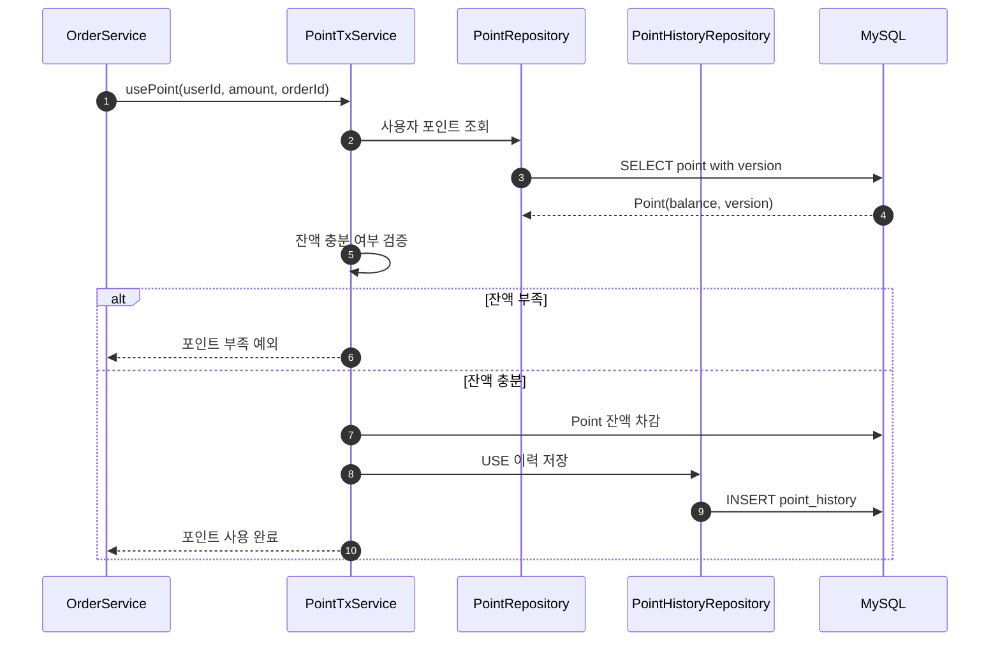
```mermaid
sequenceDiagram
    autonumber
    participant OrderService as OrderService
    participant PointService as PointTxService
    participant PointRepo as PointRepository
    participant HistoryRepo as PointHistoryRepository
    participant DB as MySQL

    OrderService->>PointService: usePoint(userId, amount, orderId)
    PointService->>PointRepo: 사용자 포인트 조회
    PointRepo->>DB: SELECT point with version
    DB-->>PointRepo: Point(balance, version)

    PointService->>PointService: 잔액 충분 여부 검증

    alt 잔액 부족
        PointService-->>OrderService: 포인트 부족 예외
    else 잔액 충분
        PointService->>DB: Point 잔액 차감
        PointService->>HistoryRepo: USE 이력 저장
        HistoryRepo->>DB: INSERT point_history
        PointService-->>OrderService: 포인트 사용 완료
    end
```

### 장애 포인트

- 동시 차감으로 잔액 음수 발생 가능
- 낙관적 락 충돌 시 재시도 필요
- Point와 PointHistory 불일치
- 주문 실패 시 포인트 복구 누락

---

## 18. 포인트 만료 배치 시퀀스

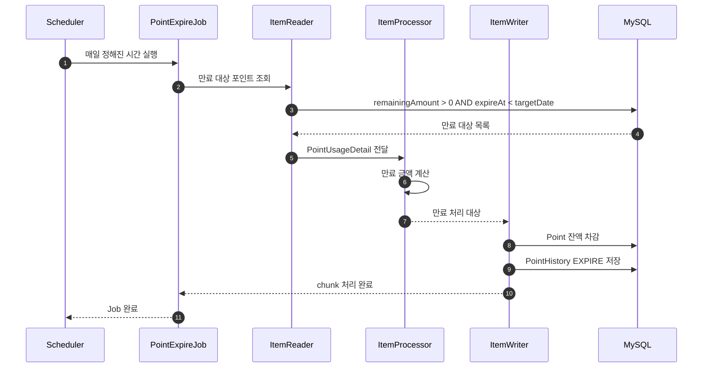
```mermaid
sequenceDiagram
    autonumber
    participant Scheduler as Scheduler
    participant BatchJob as PointExpireJob
    participant Reader as ItemReader
    participant Processor as ItemProcessor
    participant Writer as ItemWriter
    participant DB as MySQL

    Scheduler->>BatchJob: 매일 정해진 시간 실행
    BatchJob->>Reader: 만료 대상 포인트 조회
    Reader->>DB: remainingAmount > 0 AND expireAt < targetDate
    DB-->>Reader: 만료 대상 목록

    Reader->>Processor: PointUsageDetail 전달
    Processor->>Processor: 만료 금액 계산
    Processor-->>Writer: 만료 처리 대상

    Writer->>DB: Point 잔액 차감
    Writer->>DB: PointHistory EXPIRE 저장
    Writer-->>BatchJob: chunk 처리 완료

    BatchJob-->>Scheduler: Job 완료
```

### 장애 포인트

- Paging OFFSET drift로 만료 대상 누락
- 재실행 시 중복 만료 이력 생성
- 오늘 만료/어제 만료 기준 불명확
- 대량 처리 중 DB 부하 증가

---

## 19. 쿠폰 발급 시퀀스

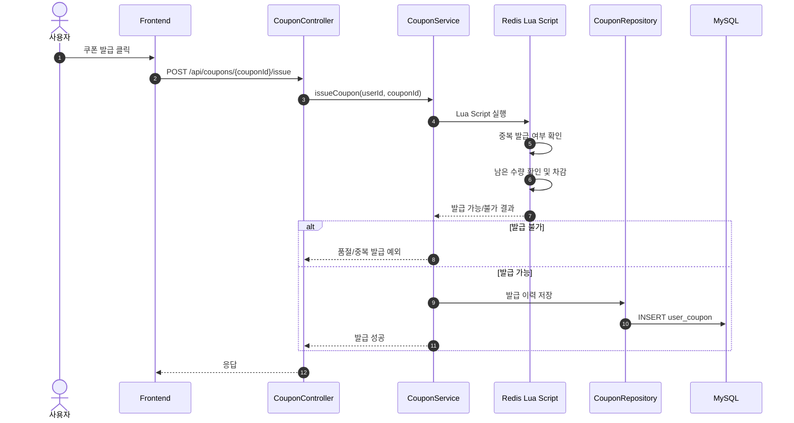
```mermaid
sequenceDiagram
    autonumber
    actor User as 사용자
    participant FE as Frontend
    participant CouponController as CouponController
    participant CouponService as CouponService
    participant Redis as Redis Lua Script
    participant CouponRepo as CouponRepository
    participant DB as MySQL

    User->>FE: 쿠폰 발급 클릭
    FE->>CouponController: POST /api/coupons/{couponId}/issue
    CouponController->>CouponService: issueCoupon(userId, couponId)

    CouponService->>Redis: Lua Script 실행
    Redis->>Redis: 중복 발급 여부 확인
    Redis->>Redis: 남은 수량 확인 및 차감
    Redis-->>CouponService: 발급 가능/불가 결과

    alt 발급 불가
        CouponService-->>CouponController: 품절/중복 발급 예외
    else 발급 가능
        CouponService->>CouponRepo: 발급 이력 저장
        CouponRepo->>DB: INSERT user_coupon
        CouponService-->>CouponController: 발급 성공
    end

    CouponController-->>FE: 응답
```

### 장애 포인트

- Redis Lua 실패 시 수량 정합성 보장 어려움
- DB 저장 실패 시 Redis 수량과 DB 이력 불일치
- DB unique constraint 부재 시 중복 발급 가능
- Redis key TTL 관리 필요

---

## 20. 구독 정기 결제 시퀀스

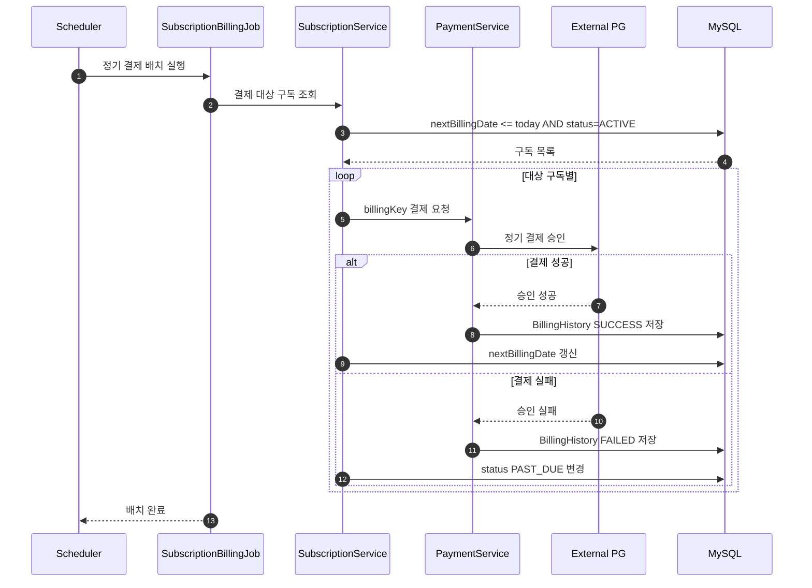
```mermaid
sequenceDiagram
    autonumber
    participant Scheduler as Scheduler
    participant SubscriptionJob as SubscriptionBillingJob
    participant SubscriptionService as SubscriptionService
    participant PaymentService as PaymentService
    participant PG as External PG
    participant DB as MySQL

    Scheduler->>SubscriptionJob: 정기 결제 배치 실행
    SubscriptionJob->>SubscriptionService: 결제 대상 구독 조회
    SubscriptionService->>DB: nextBillingDate <= today AND status=ACTIVE
    DB-->>SubscriptionService: 구독 목록

    loop 대상 구독별
        SubscriptionService->>PaymentService: billingKey 결제 요청
        PaymentService->>PG: 정기 결제 승인
        alt 결제 성공
            PG-->>PaymentService: 승인 성공
            PaymentService->>DB: BillingHistory SUCCESS 저장
            SubscriptionService->>DB: nextBillingDate 갱신
        else 결제 실패
            PG-->>PaymentService: 승인 실패
            PaymentService->>DB: BillingHistory FAILED 저장
            SubscriptionService->>DB: status PAST_DUE 변경
        end
    end

    SubscriptionJob-->>Scheduler: 배치 완료
```

### 장애 포인트

- 동일 billing cycle 중복 결제
- 배치 중단으로 일부 구독만 처리
- 결제 실패 후 상태 전이 누락
- ShedLock 미적용 시 다중 서버에서 중복 실행 가능

---

# Part 5. 리뷰/검색/알림/AI 도메인

---

## 21. 리뷰 등록 시퀀스

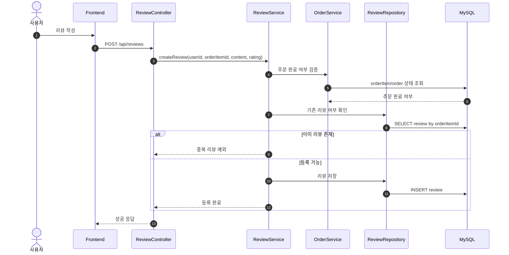
```mermaid
sequenceDiagram
    autonumber
    actor User as 사용자
    participant FE as Frontend
    participant ReviewController as ReviewController
    participant ReviewService as ReviewService
    participant OrderService as OrderService
    participant ReviewRepo as ReviewRepository
    participant DB as MySQL

    User->>FE: 리뷰 작성
    FE->>ReviewController: POST /api/reviews
    ReviewController->>ReviewService: createReview(userId, orderItemId, content, rating)

    ReviewService->>OrderService: 주문 완료 여부 검증
    OrderService->>DB: orderItem/order 상태 조회
    DB-->>OrderService: 주문 완료 여부

    ReviewService->>ReviewRepo: 기존 리뷰 여부 확인
    ReviewRepo->>DB: SELECT review by orderItemId

    alt 이미 리뷰 존재
        ReviewService-->>ReviewController: 중복 리뷰 예외
    else 등록 가능
        ReviewService->>ReviewRepo: 리뷰 저장
        ReviewRepo->>DB: INSERT review
        ReviewService-->>ReviewController: 등록 완료
    end

    ReviewController-->>FE: 성공 응답
```

### 장애 포인트

- 주문 완료 검증 누락
- 동일 orderItemId 중복 리뷰
- 리뷰 저장 후 평점 통계 갱신 실패
- 리뷰 이미지 저장 실패

---

## 22. 리뷰 AI 요약 시퀀스

```mermaid
sequenceDiagram
    autonumber
    actor User as 사용자
    participant FE as Frontend
    participant ReviewAIController as ReviewAIController
    participant ReviewAIService as ReviewAIService
    participant ReviewRepo as ReviewRepository
    participant AIClient as AI Client
    participant ExternalAI as External AI API
    participant Cache as Redis/Cache
    participant DB as MySQL

    User->>FE: 리뷰 요약 요청
    FE->>ReviewAIController: GET /api/products/{productId}/reviews/ai-summary
    ReviewAIController->>ReviewAIService: summarize(itemId)

    ReviewAIService->>Cache: 기존 요약 캐시 조회
    alt 캐시 존재
        Cache-->>ReviewAIService: cached summary
    else 캐시 없음
        ReviewAIService->>ReviewRepo: 리뷰 목록 조회
        ReviewRepo->>DB: SELECT reviews
        DB-->>ReviewRepo: reviews

        ReviewAIService->>AIClient: 리뷰 요약 요청
        AIClient->>ExternalAI: API 호출
        ExternalAI-->>AIClient: 요약 결과

        ReviewAIService->>Cache: 요약 결과 저장
    end

    ReviewAIService-->>ReviewAIController: summary
    ReviewAIController-->>FE: 요약 응답
```

### 장애 포인트

- AI API timeout 또는 429
- AI 응답 파싱 실패
- 캐시 미사용 시 비용 증가
- 핵심 상품 조회 API까지 지연 전파

---

## 23. 상품 검색 시퀀스

```mermaid
sequenceDiagram
    autonumber
    actor User as 사용자
    participant FE as Frontend
    participant SearchController as SearchController
    participant SearchService as SearchService
    participant ItemRepo as ItemRepository
    participant Cache as Redis/Cache
    participant DB as MySQL

    User->>FE: 키워드/카테고리 검색
    FE->>SearchController: GET /api/products?keyword=&category=&sort=
    SearchController->>SearchService: search(condition)

    SearchService->>Cache: 검색 결과 캐시 조회
    alt 캐시 존재
        Cache-->>SearchService: cached result
    else 캐시 없음
        SearchService->>ItemRepo: 검색 조건 기반 조회
        ItemRepo->>DB: SELECT items WHERE condition
        DB-->>ItemRepo: item page
        SearchService->>Cache: 결과 캐싱
    end

    SearchService-->>SearchController: ItemListResponse
    SearchController-->>FE: 상품 목록
```

### 장애 포인트

- page size 제한 미흡 시 DB 부하
- 검색 인덱스 부족
- 캐시 무효화 누락
- 판매중지/품절 상품 노출

---

## 24. 알림 발송 시퀀스

```mermaid
sequenceDiagram
    autonumber
    participant DomainService as 주문/결제/배송 Service
    participant Producer as NotificationProducer
    participant Kafka as Kafka
    participant Consumer as NotificationConsumer
    participant NotificationService as NotificationService
    participant DB as MySQL
    participant User as 사용자

    DomainService->>Producer: 알림 이벤트 생성
    Producer->>Kafka: notification.event 발행

    Kafka-->>Consumer: 이벤트 전달
    Consumer->>NotificationService: 알림 생성 요청
    NotificationService->>DB: notification 저장
    DB-->>NotificationService: 저장 완료

    NotificationService-->>Consumer: 처리 완료
    User->>DB: 알림 목록 조회
```

### 장애 포인트

- Kafka 장애로 이벤트 발행 실패
- Consumer 장애로 알림 지연
- 동일 이벤트 중복 소비로 중복 알림
- notification 저장 실패

---

# Part 6. 관리자/배치/배포 도메인

---

## 25. 관리자 사용자 제재 시퀀스

```mermaid
sequenceDiagram
    autonumber
    actor Admin as 관리자
    participant FE as Admin Frontend
    participant AdminController as AdminController
    participant AdminService as AdminUserService
    participant UserRepo as UserRepository
    participant AuditService as AdminAuditService
    participant Redis as Redis
    participant DB as MySQL

    Admin->>FE: 사용자 제재 요청
    FE->>AdminController: PATCH /api/admin/users/{userId}/status
    AdminController->>AdminService: deactivateUser(userId, reason)

    AdminService->>UserRepo: 사용자 조회
    UserRepo->>DB: SELECT user
    DB-->>UserRepo: User

    AdminService->>DB: active=false, tokenVersion 증가
    AdminService->>Redis: refresh token/session 삭제
    AdminService->>AuditService: 관리자 감사 로그 기록
    AuditService->>DB: admin_audit_log 저장

    AdminService-->>AdminController: 처리 완료
    AdminController-->>FE: 성공 응답
```

### 장애 포인트

- active=false 후 기존 토큰 계속 유효
- Refresh Token 삭제 누락
- 감사 로그 비동기 유실
- 관리자 권한 검증 누락

---

## 26. 배치 Job 실행 시퀀스

```mermaid
sequenceDiagram
    autonumber
    participant Scheduler as Scheduler
    participant JobLauncher as JobLauncher
    participant Job as Spring Batch Job
    participant Step as Step
    participant Reader as Reader
    participant Processor as Processor
    participant Writer as Writer
    participant Metadata as Batch Metadata Tables
    participant DB as MySQL

    Scheduler->>JobLauncher: Job 실행 요청
    JobLauncher->>Metadata: JobInstance/Execution 생성
    JobLauncher->>Job: run(jobParameters)

    Job->>Step: Step 실행
    loop Chunk 단위
        Step->>Reader: read
        Reader->>DB: 대상 데이터 조회
        DB-->>Reader: items

        Step->>Processor: process
        Processor-->>Step: processed items

        Step->>Writer: write
        Writer->>DB: 결과 저장
    end

    Step->>Metadata: StepExecution 결과 저장
    Job->>Metadata: JobExecution COMPLETED/FAILED 저장
```

### 장애 포인트

- 동일 JobParameter 중복 실행
- 실패 후 재시작 시 중복 처리
- Reader 방식 문제로 대상 누락
- chunk size 과다로 DB 부하

---

## 27. CI/CD 배포 시퀀스

```mermaid
sequenceDiagram
    autonumber
    actor Dev as 개발자
    participant GitHub as GitHub
    participant Actions as GitHub Actions
    participant Registry as Container/Artifact Registry
    participant Main as Main EC2
    participant Dummy as Dummy EC2
    participant Nginx as Nginx
    participant App as Spring Boot

    Dev->>GitHub: PR merge 또는 push
    GitHub->>Actions: workflow trigger
    Actions->>Actions: test/build
    Actions->>Registry: artifact 또는 image 업로드

    Actions->>Main: app.jar 배포
    Actions->>Dummy: app.jar 배포

    Main->>App: systemctl restart one-stop-main
    Dummy->>App: systemctl restart one-stop-dummy

    Actions->>Nginx: smoke test
    Nginx->>Main: upstream 요청
    Nginx->>Dummy: upstream 요청
    Actions-->>Dev: 배포 결과 알림
```

### 장애 포인트

- main/dummy 버전 불일치
- 한쪽 서버만 재기동 실패
- 운영 yml 차이로 라운드로빈 결과 불일치
- smoke test 부재 시 장애 늦게 발견

---

## 28. 장애 대응 시퀀스

```mermaid
sequenceDiagram
    autonumber
    actor Operator as 운영자
    participant Monitoring as Monitoring/Grafana
    participant Nginx as Nginx
    participant App as Application
    participant Logs as Logs
    participant DB as MySQL
    participant Redis as Redis

    Monitoring-->>Operator: 장애 알림 또는 사용자 제보
    Operator->>Nginx: HTTP 상태 확인
    Operator->>App: systemctl status 확인
    Operator->>Logs: journalctl 로그 확인
    Operator->>DB: 데이터 정합성 확인
    Operator->>Redis: 세션/캐시/락 상태 확인

    alt 설정 장애
        Operator->>Nginx: nginx 설정 수정
        Operator->>Nginx: nginx -t && reload
    else 애플리케이션 장애
        Operator->>App: 서비스 재기동
    else 데이터 정합성 장애
        Operator->>DB: 보정 또는 보상 트랜잭션 수행
    end

    Operator->>Monitoring: 복구 확인
    Operator->>Logs: 재발 로그 확인
    Operator-->>Operator: 장애 회고 작성
```

### 핵심 포인트

- 장애 대응은 서버 재시작으로 끝내지 않습니다.
- 반드시 사용자 영향, 원인, 데이터 정합성, 재발 방지를 함께 확인합니다.
- 결제/포인트/쿠폰/주문은 복구 후 데이터 검증이 필수입니다.

---

## 29. README 링크 추가 예시

메인 README에는 다음 링크를 추가합니다.

```markdown
- [도메인별 시퀀스 다이어그램](documents/architecture/domain-sequence-diagrams.md)
```

---

## 30. 최종 정리

도메인별 시퀀스 다이어그램은 단순한 기능 설명 문서가 아니라, 장애 대응 Runbook과 연결되는 운영 관점 문서입니다.

각 시퀀스는 다음 질문에 답할 수 있어야 합니다.

- 요청은 어디서 시작해서 어디까지 전달되는가?
- Redis, DB, Kafka, 외부 API는 어느 지점에서 사용되는가?
- 실패하면 어떤 데이터가 불일치할 수 있는가?
- 재시도 또는 보상 처리가 필요한 지점은 어디인가?
- 어떤 로그와 테이블을 확인해야 하는가?

이를 통해 One-Stop 프로젝트는 기능 구현뿐 아니라 흐름 설명, 장애 분석, 운영 대응까지 가능한 백엔드 프로젝트로 정리될 수 있습니다.
