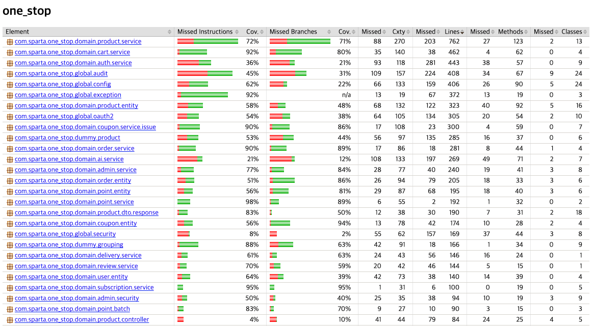

## 테스트 커버리지 요약
| 지표 | 결과 |
| --- | --- |
| 테스트 케이스 통과율 | **99.18%** (243건 중 241건 통과) |
| 전체 Instruction Coverage | **61%** |
| 전체 Line Coverage | **약 64%** |
| 전체 Branch Coverage | **56%** |
| 전체 Method Coverage | **약 61%** |
| 전체 Class Coverage | **약 72%** |

### 설명 요약
전체 243건의 테스트 케이스 중 241건을 통과해 **99.18%의 테스트 통과율**을 달성했습니다. 
JaCoCo 기준 전체 라인 커버리지는 약 **64%**, 분기 커버리지는 **56%**입니다.

핵심 비즈니스 로직인 상품, 주문, 결제, 쿠폰, 포인트, 장바구니, 알림, 배송, 구독 등 서비스 계층은 전반적으로 높은 커버리지를 확보했습니다. 예를 들어 결제 서비스 98%, 포인트 서비스 98%, 주문 서비스 90%, 쿠폰 발급 서비스 90%, 장바구니 서비스 92%, 구독 서비스 95% 수준의 Instruction Coverage를 기록했습니다.

반면 컨트롤러, DTO, 엔티티, 설정, 외부 연동 영역은 테스트 우선순위를 낮게 두었거나 서비스·통합 테스트에서 간접적으로 검증되어 상대적으로 낮은 수치를 보입니다. 이후에는 MockMvc 기반 API 테스트와 외부 연동 실패 시나리오를 추가해 **분기 커버리지와 컨트롤러 계층 커버리지**를 높이는 방향으로 확장할 수 있습니다.

### 테스트 커버리지 결과

## 도메인별 특징
| 도메인 | 주요 대상 | Instruction Coverage | Branch Coverage |
| --- | --- | --- | --- |
| 장바구니 | Cart Service | 92% | 80% |
| 주문 | Order Service | 90% | 89% |
| 결제 | Payment Service | 98% | 91% |
| 쿠폰 | Coupon Issue Service | 90% | 86% |
| 포인트 | Point Service | 98% | 89% |
| 알림 | Notification Service / Consumer / Subscriber | 100% | 100% |
| 이벤트 | Outbox Publisher | 98% | 90% |
| 구독 | Subscription Service | 95% | 95% |
| 상품 | Product Service | 72% | 71% |
| 리뷰 | Review Service | 70% | 59% |
| 관리자 | Admin Service | 77% | 84% |
주문·결제·쿠폰·포인트·알림 등 **데이터 정합성이 중요한 커머스 핵심 서비스**는 **90%** 이상의 높은 커버리지를 확보했습니다.

## 보완 방향
전체 수치가 핵심 서비스보다 낮은 이유는 컨트롤러, 설정, 보안, 외부 연동 영역의 테스트 비중이 상대적으로 낮기 때문입니다.
- Controller 계층: 다수 컨트롤러가 0~4% 수준→ `MockMvc` 기반 API 요청 검증, HTTP 상태 코드, 인증·인가 테스트 추가
- Security / OAuth2: Security 8%, Auth Service 36%→ 로그인 실패, 권한 부족, 토큰 만료, OAuth2 예외 흐름 보강
- AI Service: 21%→ 외부 OpenAI API 호출은 Mock 처리하고, 프롬프트·응답 파싱·실패 재시도 시나리오 보강
- Scheduler / 외부 연동: 낮은 커버리지→ 배치 실행 조건, 실패·재시도, 외부 API 장애 시나리오 추가

## 결론

본 프로젝트는 핵심 비즈니스 로직을 중심으로 테스트를 설계하여 높은 수준의 안정성을 확보했습니다.

특히 주문, 결제, 쿠폰, 포인트, 알림, 구독과 같이 데이터 정합성과 상태 관리가 중요한 도메인에 대해 집중적으로 테스트를 수행했으며, 정상 흐름뿐 아니라 예외 처리, 동시성 제어, 상태 전이 시나리오까지 검증했습니다.

전체 커버리지 수치보다는 커머스 서비스의 핵심 기능을 안정적으로 검증하는 데 중점을 두었으며, 향후에는 컨트롤러 계층, 인증·인가, 외부 연동 및 스케줄러 영역의 테스트를 보강하여 시스템 전반의 품질을 더욱 향상시킬 계획입니다.